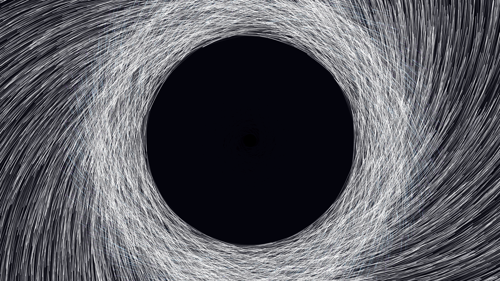

# kinetic_gravitational_lensing_accretion_disk_2d

## Metadata
- **Date**: 2026-06-30
- **Theme**: An abstract visualization of a super-massive gravitational lens distorting a field of stars, forming
- **Technique**: A high-performance 2D particle system using 15,000 particles. Vectorized numpy operations calculate a strong inverse-square central gravitational pull alongside a tangential rotational force to simulate the swirling accretion disk. Particles are re-spawned at the edges if they fall past the event horizon. Speed-based bucketing is used to color the particles, mimicking a relativistic blue shift (violet to cyan to blinding white). Additive blending (`py5.ADD`) creates the glowing, dense starfield effect.
- **Logic Lab Reference**: 

## Concept
An abstract visualization of a super-massive gravitational lens distorting a field of stars, forming a glowing accretion disk. It features a stark, massive black event horizon surrounded by swirling, fast-moving particles that are stretched by extreme gravitational forces.

## Technical Details
- **Renderer**: Unknown
- **Simulation**: Unknown
- **Visuals**: Unknown
- **Animation**: Contains animation details
