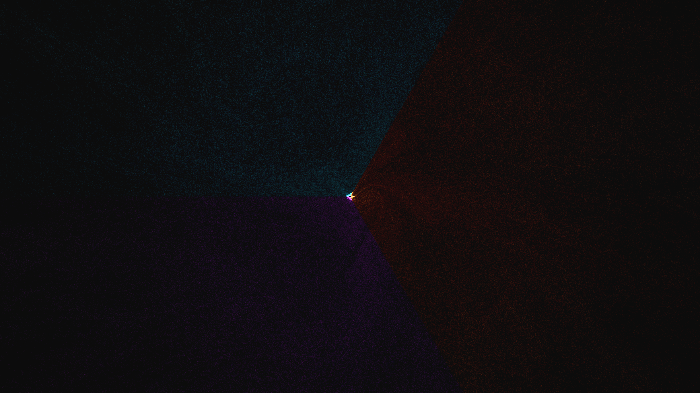

# kinetic_gumowski_mira_attractor_morph_2d

## Metadata
- **Date**: 2026-07-01
- **Theme**: An abstract visualization of the Gumowski-Mira attractor, a discrete 2D chaotic mapping that yields 
- **Technique**: Unknown
- **Logic Lab Reference**: 

## Concept
An abstract visualization of the Gumowski-Mira attractor, a discrete 2D chaotic mapping that yields highly organic, alien-like geometries reminiscent of marine life or microscopic biological structures.

## Technical Details
- **Renderer**: Unknown
- **Simulation**: Unknown
- **Visuals**: Unknown
- **Animation**: Contains animation details
