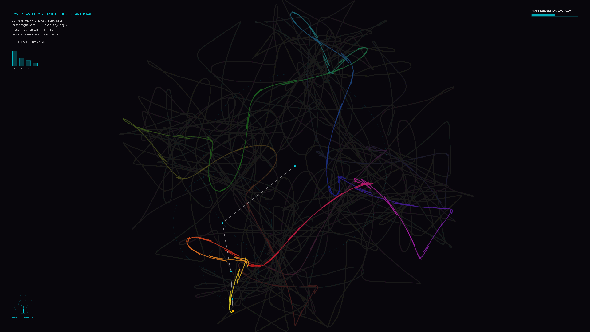

# kinetic_harmonic_pantograph_epicycles_2d

## Metadata
- **Date**: 2026-08-03
- **Theme**: Celestial orbits, mechanical clockwork, epicycles, Fourier harmonics
- **Technique**: Multi-arm Fourier epicyclic linkages (4 stages), real-time LFO speed/drift modulation, circular diagnostic sweep radars, dynamic HSB gradient trails, and laboratory HUD telemetry.
- **Logic Lab Reference**: [harmonic_pantograph.py](file:///Users/asami/develop/art/logic-lab/src/logic_lab/oscillators/harmonic_pantograph/harmonic_pantograph.py)

## Concept
This artwork visualizes the geometry of rotational epicycles. A linkage of four jointed arms, spinning at harmonically related frequencies, traces out a spirographic mandala.
To prevent the paths from repeating statically, the frequencies and speeds are continuously modulated using slow LFOs (Low Frequency Oscillators). This causes the joints to slide and drift, morphing the resulting geometry in an organic, continuous flow.
The drawing arms and circular gear tracks are rendered as delicate, glowing structures directly on the 4K canvas to preserve coordinate crispness. The tip of the final arm deposits a bioluminescent trail onto an offscreen buffer, blending dynamically with the deep obsidian black background.
The outer boundary of the canvas is framed by a technical HUD, featuring a real-time Fourier amplitude bar chart, joint angular radars, active speed metrics, and corner alignment targets.

## Technical Details
- **Renderer**: Java2D
- **Linkages**: 4 stages with radii (150, 80, 45, 20) and base frequencies (1, -3, 7, -13).
- **LFO Modulation**: speed_mod ($1.0 \pm 0.25$), arm2_drift ($0 \pm 0.12$), and arm3_drift ($0 \pm 0.18$).
- **Visuals**: HSB hue-cycling line trails, offscreen image buffer blending, and 4K vector gear overlays.
- **Animation**: 20 seconds @ 60 FPS (1200 frames)
