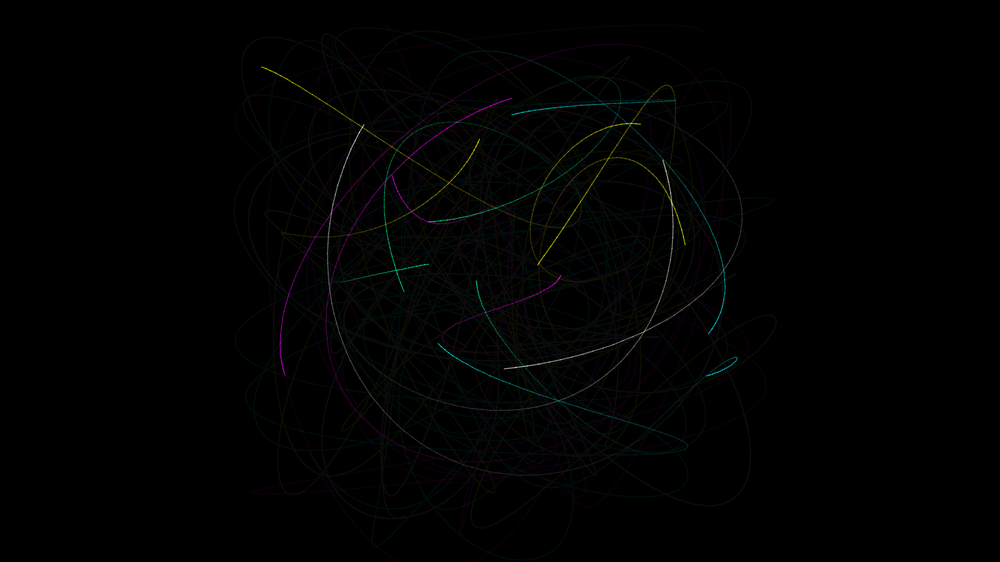

# kinetic_harmonic_pendulum_web_2d

## Metadata
- **Date**: 2026-06-28
- **Theme**: Simulates multiple interconnected pendulums swinging in harmonic motion, tracing continuous silky tr
- **Technique**: The sketch uses partial screen clearing (drawing a semi-transparent black rectangle with very low opacity each frame) to produce heavy motion blur and long, fading trails. 20 distinct points trace complex Lissajous-like paths. These paths are generated by combining 4 cascaded harmonic oscillators for each point, with both their frequencies and phases continuously modulated by smooth Perlin noise. The trails are drawn using additive blending to create intense, overlapping light beams.
- **Logic Lab Reference**: 

## Concept
Simulates multiple interconnected pendulums swinging in harmonic motion, tracing continuous silky trails. The glowing trails fade out slowly over time, leaving an intricate, evolving web of light that visualizes complex nested oscillations.

## Technical Details
- **Renderer**: Unknown
- **Simulation**: Unknown
- **Visuals**: Unknown
- **Animation**: Contains animation details
