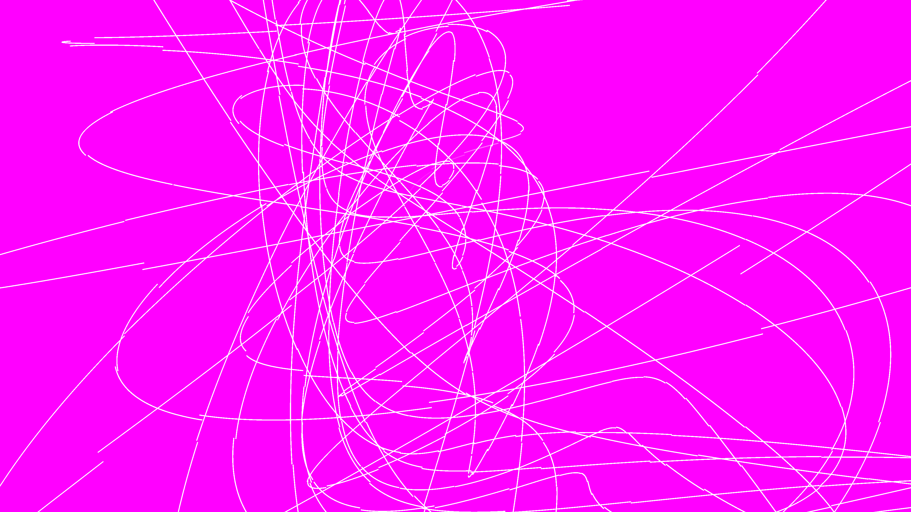

# kinetic_harmonograph_pendulum_spirograph_3d

## Metadata
- **Date**: 2026-06-14
- **Theme**: An animated 15s sequence showing a single sharp line rapidly spinning to leave glowing trails that f
- **Technique**: Parametric 3D formulas combining multiple decaying sine waves with phase offsets on all three axes (X, Y, Z). The curves are drawn as glowing line strips with a neon color gradient that shifts across the drawn path, accumulating into a beautiful mathematical flower.
- **Logic Lab Reference**: 

## Concept
An animated 15s sequence showing a single sharp line rapidly spinning to leave glowing trails that form a precise geometric web.

## Technical Details
- **Renderer**: Unknown
- **Simulation**: Unknown
- **Visuals**: Unknown
- **Animation**: Unknown
