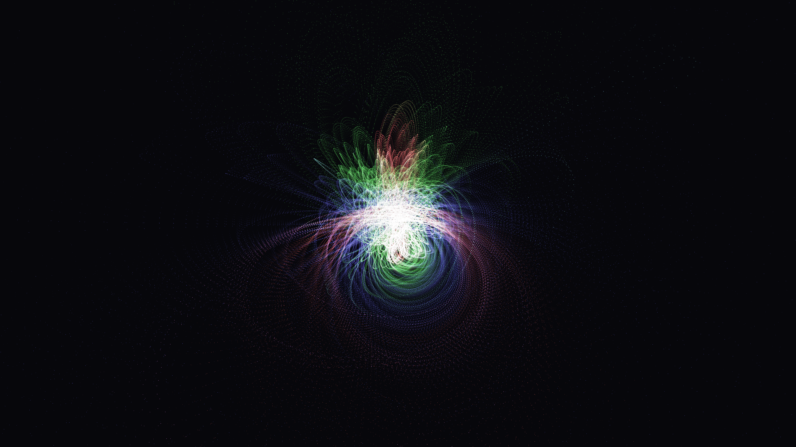

# kinetic_hopf_fibration_projection_2d

## Metadata
- **Date**: 2026-07-01
- **Theme**: An animated sequence of glowing rings projected from 4-dimensional space
- **Technique**: Unknown
- **Logic Lab Reference**: 

## Concept
An animated sequence of glowing rings projected from 4-dimensional space. The Hopf Fibration mathematically maps a 3-sphere (a sphere in 4D space) to a 2-sphere (a standard 3D sphere). By applying stereographic projection, this 4D structure is mapped down into 3D, and then projected again into 2D, revealing beautifully interlocking Villarceau circles.

## Technical Details
- **Renderer**: Unknown
- **Simulation**: Unknown
- **Visuals**: Unknown
- **Animation**: Contains animation details
