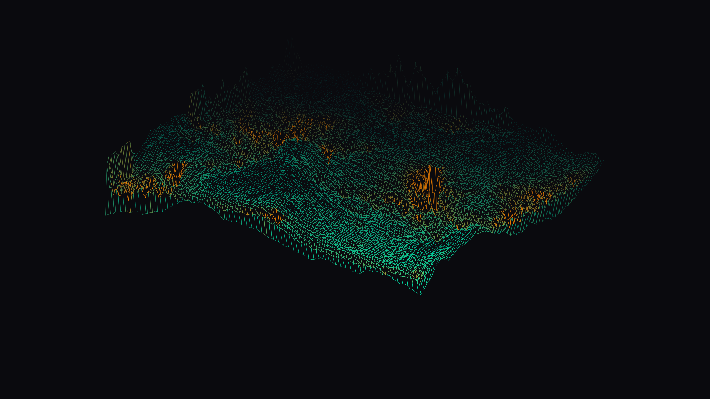

# kinetic_hydraulic_erosion_terrain_3d

## Metadata
- **Date**: 2026-08-02
- **Theme**: Geological timescales, erosion dynamics, digital landscape topography
- **Technique**: Particle-based hydraulic erosion, Diamond-Square fractal heightmap generation, isometric 3D projection, depth-sorted Painter's occlusion rendering.
- **Logic Lab Reference**: [hydraulic_erosion.py](file:///Users/asami/develop/art/logic-lab/src/logic_lab/procedural_terrain/hydraulic_erosion/hydraulic_erosion.py)

## Concept
This piece visualizes the carving of a digital mountain landscape by water over geological timescales. The heightmap begins as a rough fractal terrain generated using the Diamond-Square algorithm. Virtual water droplets spawn randomly, flowing down the terrain's gradient, carrying sediment, and depositing it in depressions while eroding ridgelines.
The 3D landscape is projected isometrically and rendered as a minimalist glowing wireframe grid. A depth-sorted painter's occlusion algorithm ensures that hidden lines are cleanly masked out by solid polygon fills, creating a highly technical, architectural aesthetic. As the simulation progresses, the camera slowly orbits the terrain, and active water flow channels are illuminated in glowing gold/orange, dynamically contrasting with the cool neon teal topography.

## Technical Details
- **Renderer**: Java2D
- **Simulation**: 128x128 grid updated with 500 droplets per frame (Euler integration, bilinear height and gradient lookup, sediment carrying capacity).
- **Projection**: Y-axis rotation followed by isometric projection, with depth sorting of all 16,129 grid quads.
- **Animation**: 15 seconds @ 60 FPS (900 frames)
