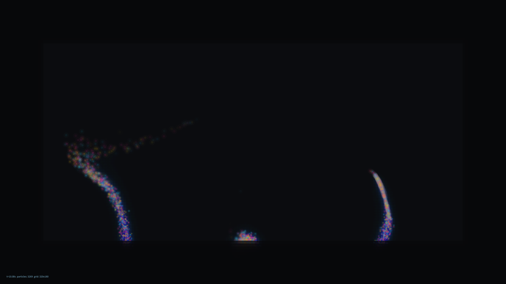

# kinetic_hydrothermal_dye_plume_2d

## Metadata
- **Date**: 2026-08-06
- **Theme**: Abyssal hydrothermal vents, volumetric fluid plumes, particle advection, density diffusion
- **Technique**: Vectorized 2D NumPy density grid diffusion (via fast rolling box blur), Perlin-like wave advection flow field (sine/cosine summation), dual-pass glowing particle halos, low-alpha volumetric fog upscaling, telemetry HUD.

## Concept
A 4K kinetic visualization representing the silent, volumetric flow of a hydrothermal vent deep in the ocean abyss. Highly energetic particles are emitted from benthic fissures, rising under thermal buoyancy while being swept away by turbulent deep-sea currents. 

The particles carry a dye/density value that they deposit onto a coarse grid. This grid undergoes a continuous box-blur diffusion process in NumPy and is upscaled to 4K resolution using low-alpha overlapping rectangles, producing a soft volumetric fog effect. Overlaid on this glowing plume are individual particle cores with dual-pass halos and a structural technical telemetry HUD.

## Technical Details
- **Renderer**: Java2D
- **Simulation**: Vectorized wave-based flow field (16 wave components) advecting up to 4000 particles, coupled with a 320x180 density grid (0.955 decay rate, 5-pass roll-based diffusion).
- **Visuals**: HSB abyssal palette, dual-pass particle halos, volumetric upscaling, vignette framing, and readout HUD.
- **Animation**: 20 seconds @ 60 FPS (1200 frames)
