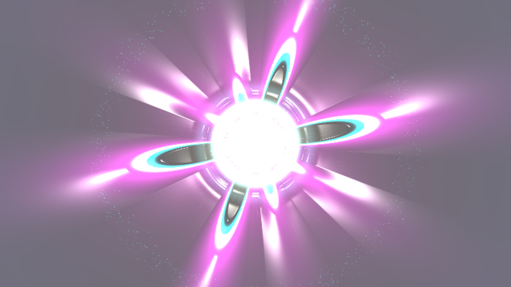

# kinetic_icf_ablative_implosion_stagnation_2d

A 15-second kinetic media art visualization of Inertial Confinement Fusion (ICF): laser/X-ray ablation drive, convergent spherical shock waves, ablative Rayleigh-Taylor instability (RTI) spike-and-bubble growth with Bell-Plesset geometric convergence, core stagnation rebound shock, thermonuclear ignition flash, and relativistic alpha-particle fireworks.

## Concept & Physics

In high-power laser facilities (such as the National Ignition Facility, NIF), cryogenic Deuterium-Tritium (DT) spherical fuel capsules are compressed to extreme thermonuclear conditions ($T > 10^7 \text{ K}$, $\rho > 1000 \text{ g/cm}^3$) through laser-indirect drive inside a hohlraum:

1. **Ablation Drive & Inward Acceleration ($t = 0.0\text{s} - 8.5\text{s}$)**:
   Intense soft X-ray radiation ablates the outer high-density carbon (diamond) shell, generating massive outward coronal blowoff. The rocket reaction force drives an accelerating convergent spherical shock wave inward at over $400 \text{ km/s}$.

2. **Ablative Rayleigh-Taylor Instability & Bell-Plesset Convergence**:
   As the shell accelerates inward ($g_{eff} < 0$), intermediate Legendre modes ($l = 4..12$) grow unstable. While high wavenumbers are ablated away (Takabe-Bodner stabilization), intermediate modes undergo fierce non-linear amplification exacerbated by spherical convergence (Bell-Plesset effect: $\delta R/R \sim R^{-\nu}$).
   Inward-penetrating cryogenic fuel spikes ("cold fingers") plunge toward the center, while low-density hot ablation bubbles expand outward into rounded domes.

3. **Core Stagnation & Thermonuclear Flash ($t = 8.5\text{s} - 12.0\text{s}$)**:
   The converging shock collapses at the center, rebounds, and violently halts the incoming shell in a deceleration Rayleigh-Taylor vortex sheet.
   Kinetic energy converts into extreme thermal pressure: the central hot spot ignites into a blinding Bremsstrahlung X-ray flash ($T > 5 \times 10^7 \text{ K}$).

4. **Thermonuclear Burn & Alpha Fireworks ($t = 12.0\text{s} - 15.0\text{s}$)**:
   Self-heating alpha particles ($^4\text{He}$) deposit energy into the surrounding compressed cold fuel, driving an explosive outward deflagration wave and scattering relativistic neutron and alpha spark fireworks into the surrounding corona.

## Visual Dynamics

- **Convergent DT Shell**: Glacial electric cyan and deep sapphire blue spherical layer with compressed refractive relief.
- **Ablative RTI Spikes & Bubbles**: Deep inward-reaching cold finger cusps and broad outward hot domes breaking spherical symmetry.
- **X-Ray Coronal Blowoff**: Outward expanding ionized plasma in radiant cerise magenta and deep violet.
- **Thermonuclear Hot Spot Ignition**: Blinding diamond-white and incandescent solar gold Bremsstrahlung flash.
- **Specular Plasma Chrome**: Dual-light Blinn-Phong specular glints reflecting off shock discontinuities and spike cusps.
- **Lagrangian Fireworks**: Cold fuel spike beads, expanding coronal exhaust ions, and isotropic relativistic alpha sparks.

## Color Palette

- **Thermonuclear Hot Spot Flash & Core** (`#ffffff`, `#fff0a0`, `#ffb703`): Blinding diamond white and incandescent solar gold (25%).
- **Cryogenic DT Fuel Shell & Inward RTI Spikes** (`#00f0ff`, `#0077b6`): High-density compressed plasma in electric glacial cyan and deep sapphire blue (45%).
- **X-Ray Ablation Front & Coronal Blowoff** (`#b5179e`, `#7209b7`): Radiant cerise magenta and ionized violet (25%).
- **Vacuum / Hohlraum Cavity Void** (`#02040b`, `#080d1e`): Deep obsidian indigo void (background, 5%).

## Technical Implementation

- **Platform**: py5 (Python Processing architecture)
- **Continuum Fields**: 2D spherical/polar coordinate mapping, multi-mode ablative RTI modal superposition with non-linear Layzer spike sharpening, Bell-Plesset convergence scaling, and rebound shock wave formulation.
- **Surface Optics**: Composite optical relief gradient surface normals $\vec{N} = (-\nabla H, 1.0)$ with dual-light Blinn-Phong specular plasma chrome shading.
- **Particle Dynamics**: 3-species Lagrangian particle system (cryogenic fuel tracers, coronal exhaust ions, and thermonuclear alpha/neutron sparks) rendered with additive blending (`ADD`).
- **Output**: 3840×2160 / 1920×1080 @ 60fps (900 frames, 15 seconds), H.264 video.
