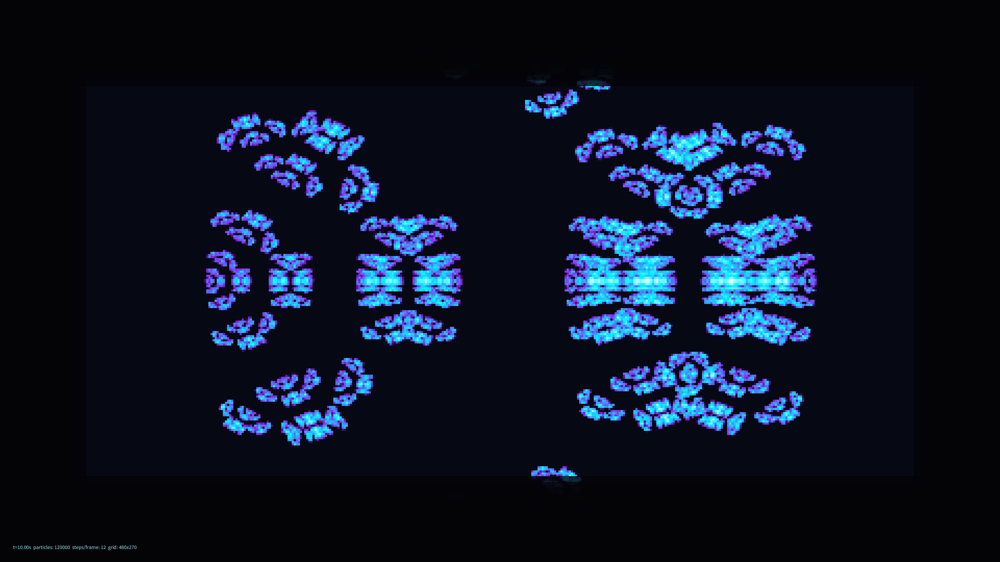

# kinetic_ifs_fractal_flame_2d

## Metadata
- **Date**: 2026-08-06
- **Theme**: Iterated Function Systems (IFS), fractal flame, chaos game, mathematical attractors
- **Technique**: Vectorized Chaos Game algorithm (120,000 particles in parallel), morphing affine transform matrices (LFO-modulated parameters), 2D density grid log-scaled histogram accumulation, vectorized custom color mapping (purple-to-cyan-to-white), direct memory pixel blitting (`np_pixels`), vignette shadow, telemetry HUD.

## Concept
A 4K kinetic visualization of an Iterated Function System (IFS) fractal flame morphing and breathing over time. Using the Chaos Game algorithm, 120,000 points are evolved in parallel using vectorized affine transformations. Instead of standard scatter plots, point positions are accumulated in a 2D density grid.

The accumulation histogram is log-scaled (revealing both dense core structures and fine filament structures) and colorized using a custom-constructed gradient that transitions from deep indigo/purple through glowing violet and electric cyan to hot white. The resulting grid is upscaled and written directly to the screen memory via py5's `np_pixels` interface to achieve high-performance rendering.

## Technical Details
- **Renderer**: Java2D
- **Simulation**: Vectorized IFS iteration using 5 morphing affine transformations. Operates 12 updates per frame for 120,000 particles, accumulating to a 480x270 density buffer (0.85 decay rate).
- **Visuals**: Direct `np_pixels` memory blitting, custom color mapping, vignette frame overlay, and technical telemetry HUD.
- **Animation**: 20 seconds @ 60 FPS (1200 frames)
