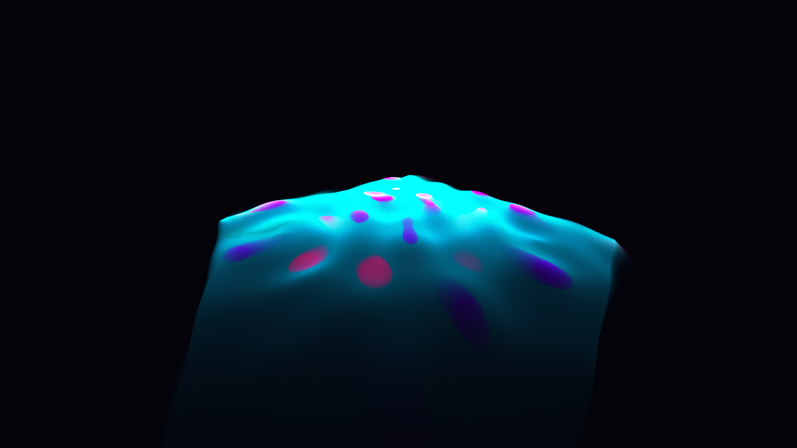

# kinetic_interference_standing_waves_2d

## Metadata
- **Date**: 2026-07-01
- **Theme**: An abstract, kinetic visualization of 2D wave interference patterns, rendered as a glowing, undulati
- **Technique**: Unknown
- **Logic Lab Reference**: 

## Concept
An abstract, kinetic visualization of 2D wave interference patterns, rendered as a glowing, undulating three-dimensional membrane.

## Technical Details
- **Renderer**: Unknown
- **Simulation**: Unknown
- **Visuals**: Unknown
- **Animation**: Contains animation details
