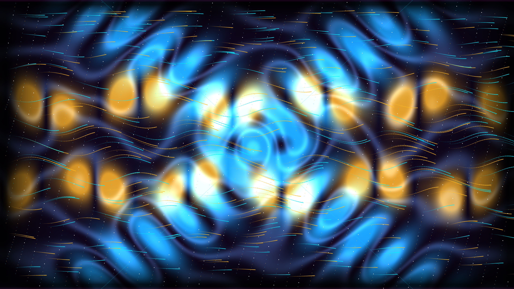

# kinetic_internal_gravity_wave_stratified_shear_2d

Kinetic 2D geophysical fluid dynamics simulation of Internal Gravity Waves (IGW), St. Andrew's Cross radiation beams, and Kelvin-Helmholtz breaking billows in a stably stratified sheared ocean.

## Concept & Scientific Background

Internal gravity waves are pervasive throughout Earth's oceans and atmosphere, acting as the primary conduit for transporting momentum and energy from large-scale tides and planetary winds down to micro-scale turbulent mixing:

1. **Buoyancy Frequency & Stable Stratification**:
   In a density-stratified fluid where lighter water overlies denser fluid ($\frac{d\rho_0}{dz} < 0$), displaced fluid parcels experience a restoring Archimedean buoyancy force, oscillating vertically at the fundamental **Brunt-Väisälä frequency**:
   $$N = \sqrt{-\frac{g}{\rho_0}\frac{d\rho_0}{dz}}$$

2. **Transverse Energy Propagation & The St. Andrew's Cross**:
   Unlike surface water waves, the dispersion relation for internal gravity waves depends only on the wave propagation angle $\theta$ relative to gravity, independent of wavenumber magnitude:
   $$\omega = N \cos \theta$$
   A unique consequence of this anisotropic dispersion is that wave crests (phase velocity $\mathbf{c}_p$) travel perpendicular to the direction of wave energy transport (group velocity $\mathbf{c}_g$):
   $$\mathbf{c}_g \cdot \mathbf{k} = 0$$
   When an underwater obstacle (e.g., an oscillating tidal current across a seamount or sill) forces the fluid at frequency $\omega < N$, energy radiates along four diagonal ray beams forming the iconic **St. Andrew's Cross** pattern.

3. **Lee Waves & Shear Instability**:
   As stratified flow sweeps across bathymetry, standing lee wave trains form downstream. When the background horizontal shear $dU/dz$ increases such that the gradient **Richardson number** drops below the Miles-Howard critical stability threshold:
   $$Ri = \frac{N^2}{(dU/dz)^2} < \frac{1}{4}$$
   the wave crests become dynamically unstable, steepening and rolling up into periodic **Kelvin-Helmholtz cat's-eye vortex billows** that break into turbulent mixing plumes (rendered as incandescent solar topaz and amber fire).

4. **Schlieren Caustic Visualization**:
   In laboratory stratification tanks, internal waves are visualized using **Schlieren and shadowgraph optical systems**, which map spatial gradients of density and refractive index ($|\nabla \rho|$) into iridescent caustic interference ribbons.

5. **Blinn-Phong Specular Ocean Sheen**:
   Dynamic surface normal fields derived from density gradients and wave kinetic energy produce dual-source Blinn-Phong specular reflections (liquid platinum and diamond chrome).

## Color Palette

- **Abyssal Obsidian Void** (`#010310`): Deep unilluminated pelagic ocean trench.
- **Bioluminescent Glacial Cyan** (`#00f5ff`): Resonant internal wave radiation beams and isopycnal surfaces.
- **Solar Topaz & Amber Fire** (`#ffb300`): Breaking Kelvin-Helmholtz billow vortex cores and turbulent dissipation.
- **Laser Cerise & Royal Violet** (`#ff0077`): High-shear Schlieren caustic refractive index bands.
- **Diamond Chrome White** (`#ffffff`): Reluminescent fluid parcel sparks and Blinn-Phong specular highlights.

## Technical Specifications

- **Resolution**: 1920 × 1080 (16:9 widescreen)
- **Frame Rate**: 60 FPS
- **Duration**: 900 frames (15.0 seconds seamless periodic loop)
- **Engine**: py5 (Processing for Python) in P2D mode with vectorized NumPy physics
- **Video Output**: H.264 MP4 (`yuv420p`, CRF 18) via automatic ffmpeg assembly
