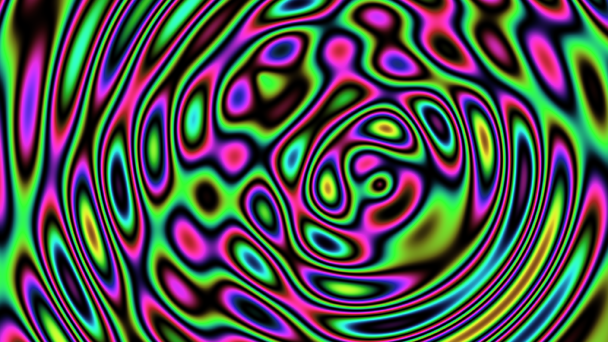

# kinetic_iridescent_interference_ripples_2d

## Metadata
- **Date**: 2026-06-21
- **Theme**: An organic fluid-like visual simulating liquid crystal light interference
- **Technique**: Unknown
- **Logic Lab Reference**: 

## Concept
An organic fluid-like visual simulating liquid crystal light interference.

## Technical Details
- **Renderer**: Unknown
- **Simulation**: Unknown
- **Visuals**: Unknown
- **Animation**: Contains animation details
