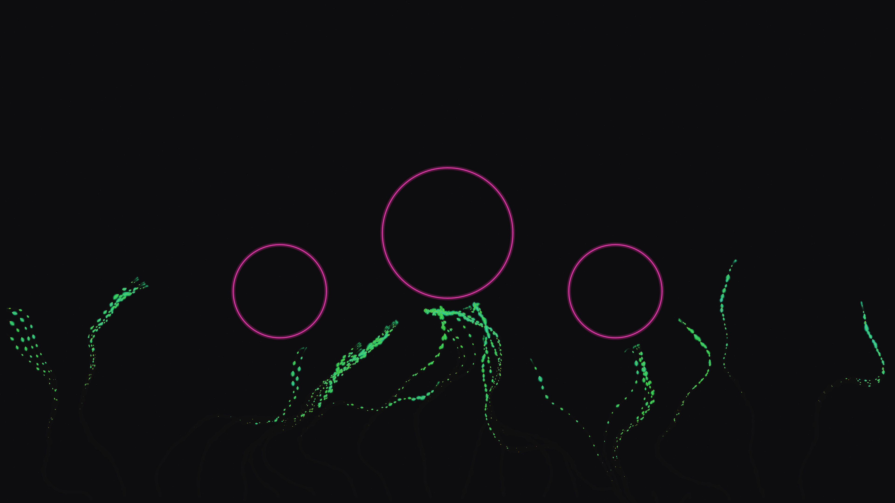

# kinetic_ivy_structure_growth_2d

## Metadata
- **Date**: 2026-08-02
- **Theme**: Organic adaptation to structural constraints in a neon-classical architectural space.
- **Technique**: Obstacle-avoidance steering behaviors, simplex noise wander advection, dynamic leaf geometry growth, wind-sway leaf rotation, multi-pass neon stroke glow.
- **Logic Lab Reference**: `steering_behaviors/ivy_wall_growth/ivy_wall_growth.py`

## Concept
This sketch explores the aesthetic relationship between natural growth dynamics and clean geometric structures. On a dark, slate-textured background, three circular portals glow with soft violet neon light. From the bottom of the canvas, 20 initial ivy tendrils creep upward. Driven by upward bias, curl noise wander forces, and obstacle-avoidance rules, the vines navigate the wall. When they encounter the glowing portals, the steering force guides them around the circular rims, wrapping them in an organic embrace. Translucent leaves sprout along the path, growing and shrinking dynamically, and sway gently in response to a global noise-based wind field.

## Technical Details
- **Renderer**: P2D
- **Simulation**: Particle agents guided by steering force equations, including distance-based circular portal repulsion, noise fields, and velocity rotation branching.
- **Visuals**: Multi-pass additive stroke glow rendering, dynamic bezier leaf geometry with Solar Gold detail veins, and a persistent slate-gray background particle noise field.
- **Animation**: 15 seconds (900 frames) @ 60 FPS.
