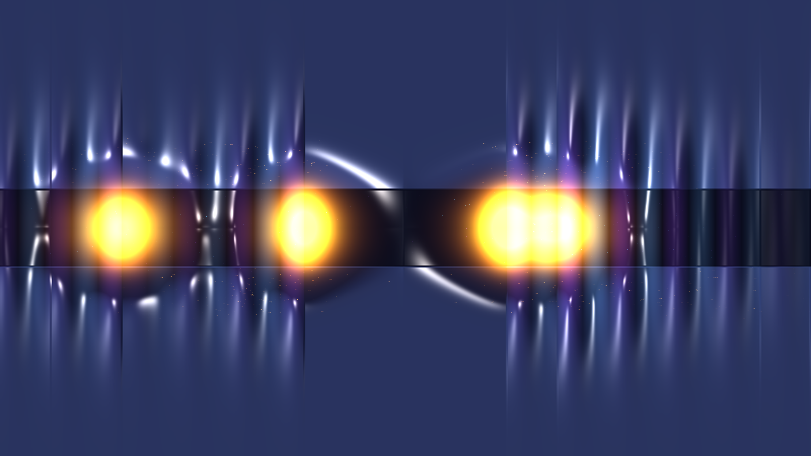

# kinetic_josephson_vortex_swihart_solitons_2d

A 15-second kinetic media art visualization of relativistic quantum electrodynamics in a Long Josephson Junction (LJJ): Josephson vortex solitons (fluxons) propagating at near-Swihart velocities, experiencing Lorentz contraction, shedding Cherenkov plasma wake waves, and undergoing topological fluxon-antifluxon annihilation collisions.

## Concept & Physics

A Long Josephson Junction consists of two superconducting electrodes (e.g. Niobium) separated by an ultrathin dielectric insulating barrier. The macroscopic quantum phase difference $\phi(x, y, t)$ across the barrier obeys the 2D perturbed Sine-Gordon equation:
$$\nabla^2 \phi - \frac{1}{\bar{c}^2} \frac{\partial^2 \phi}{\partial t^2} - \sin\phi = \alpha \frac{\partial \phi}{\partial t} - \gamma_{bias}$$
where $\bar{c}$ is the Swihart velocity—the characteristic electromagnetic wave velocity in the superconducting strip line.

1. **Topological Fluxons**: Stable $2\pi$ phase kinks carrying exactly one magnetic flux quantum $\Phi_0 = h/2e$. Inside the barrier, they manifest as localized magnetic field bundles $B_z \propto \partial \phi / \partial x$.
2. **Relativistic Lorentz Contraction**: When accelerated by a bias current up to velocities $v \to \bar{c}$, fluxons contract along their direction of motion by the Lorentz factor:
   $$\gamma_L = \frac{1}{\sqrt{1 - (v/\bar{c})^2}}$$
   compressing into razor-sharp, knife-edge solitons.
3. **Cherenkov Plasma Wakes**: Moving solitons radiate dispersive Josephson plasma waves trailing behind the vortex cores.
4. **Fluxon-Antifluxon Annihilation Collisions**: Counter-propagating kinks ($+2\pi$) and antikinks ($-2\pi$) collide head-on, converting topological winding energy into an explosive, localized high-frequency breather that radiates concentric plasma shock rings into the electrodes.
5. **Meissner Supercurrent Loops**: Superconducting screening currents curl around the fluxon cores in counter-rotating vortex loops.

## Visual Dynamics

- **Superconducting Electrodes**: Dense niobium titanium slate with 3D liquid chrome specular edge reflections.
- **Relativistic Soliton Blades**: Blazing golden fluxon cores compressed into knife-edge disks as they accelerate along the tunnel channel.
- **Cherenkov Plasma Fringes**: Actinic ultraviolet and electric cyan wave ripples trailing behind the fluxons.
- **Topological Annihilation Bursts**: Blinding diamond-white central detonation flashes with radiant concentric plasma rings.
- **Cooper Pair Streamlines**: Lagrangian supercurrent tracers orbiting the passing fluxons.

## Color Palette

- **Relativistic Fluxon Cores** (`#ffb830`, `#ff7a00`, `#e65c00`): Soliton magnetic field cores in incandescent amber, solar gold, and molten copper (60%).
- **Superconducting Electrodes & Plasma Wakes** (`#101426`, `#2de2e6`, `#8c43ff`): Niobium metal slate with trailing Cherenkov waves in electric cyan and actinic ultraviolet (30%).
- **Topological Annihilation Flashes** (`#ffffff`, `#fff5dc`): Collision singularities and specular chrome glints in diamond-white and solar platinum (10%).
- **Cryogenic Vacuum Abyss** (`#04050d`): Deep non-reflective obsidian void.

## Technical Implementation

- **Platform**: py5 (Python Processing architecture)
- **Soliton Electrodynamics**: Analytical Sine-Gordon soliton formulation with dynamic Lorentz contraction $\gamma_L(v)$, Swihart phase kinematics, and breather collision synthesis.
- **Surface Optics**: Blinn-Phong specular normal mapping computed from magnetic flux and electrode geometry.
- **Particles**: Lagrangian Meissner screening supercurrents and topological annihilation spark bursts with additive blending (`ADD`).
- **Output**: 3840×2160 / 1920×1080 @ 60fps (900 frames, 15 seconds), H.264 video.
