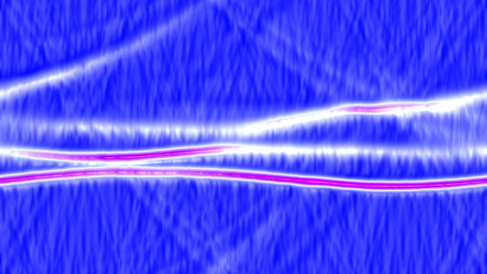

# kinetic_kadomtsev_petviashvili_solitons_2d

## Metadata
- **Date**: 2026-08-17
- **Theme**: Bioluminescent soliton webs colliding and reforming on a dark, shallow fluid layer.
- **Technique**: Vectorized 2D pseudospectral solver of the Kadomtsev-Petviashvili (KP-II) equation using split-step Fourier methods in NumPy, and a Blinn-Phong specular liquid surface shader.

## Concept
This artwork explores the self-organizing geometry of line solitons under the Kadomtsev-Petviashvili (KP-II) equation. In shallow fluid surfaces, these solitary wave fronts do not simply pass through each other or form linear overlays; instead, they interact nonlinearly to form stable, high-amplitude web patterns (soliton resonance). The visual design simulates a dark fluid plane where these wave-packets glow with an electric teal color, intensifying into warm, bioluminescent amber and lime greens at the collision junctions.

## Technical Details
- **Renderer**: Py5 default (updated pixel buffer directly)
- **Simulation**: Split-step Fourier Method (pseudospectral solver) with a 2/3 de-aliasing filter in NumPy
- **Visuals**: Dynamic gradient color-interpolation, Blinn-Phong specular lighting via custom normal maps, and bilinear upscaling from simulation grid to screen resolution.
- **Animation**: 15s @ 60fps
