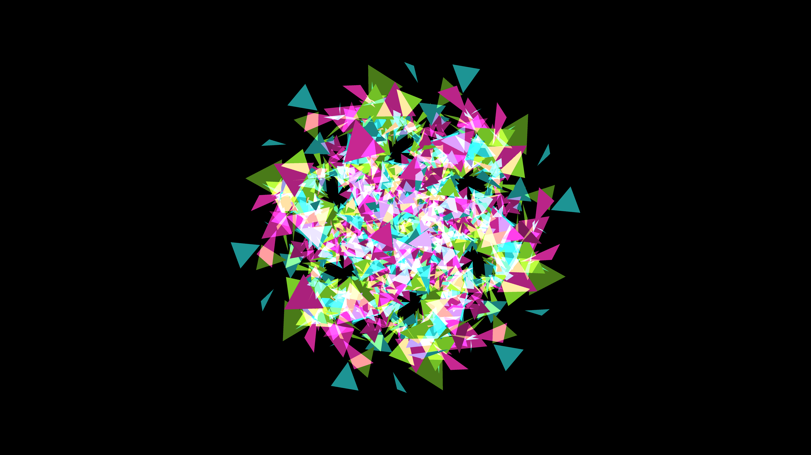

# kinetic_kaleidoscope_mirror_room_3d

## Metadata
- **Date**: 2026-06-14
- **Theme**: **Date**: 2026-06-12 **Format**: Animation (15s @ 60fps) **Theme**: A mesmerizing 3D kaleidoscope ef
- **Technique**: Unknown
- **Logic Lab Reference**: 

## Concept
**Date**: 2026-06-12
**Format**: Animation (15s @ 60fps)
**Theme**: A mesmerizing 3D kaleidoscope effect, as if placing the camera inside an infinite mirror room containing floating, rotating neon geometric solids.
**Technique**: A central cluster of rotating 3D platonic solids (tetrahedrons, cubes, octahedrons) drawn with thick neon wireframes. The kaleidoscope effect is simulated procedurally without actual ray-traced mirrors: the canvas is split into wedge segments, and the drawing matrix is rotated and flipped repeatedly to create perfect radial symmetry, imitating an infinite mirror room.

## Technical Details
- **Renderer**: Unknown
- **Simulation**: Unknown
- **Visuals**: Unknown
- **Animation**: Contains animation details
