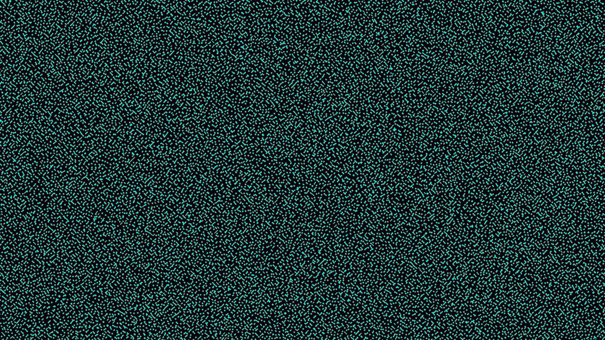

# kinetic_keller_segel_chemotaxis_2d

A 4K kinetic visualization of self-aggregating biological patterns using the volume-filling Keller-Segel chemotaxis model, simulating cell clustering and vascular network self-assembly.

## Concept

The Keller-Segel chemotaxis equations describe the self-organization of cellular populations attracted to the gradients of chemical signals they themselves secrete:
$$\frac{\partial \rho}{\partial t} = D_\rho \nabla^2 \rho - \chi \nabla \cdot \left( \rho (1 - \rho) \nabla c \right)$$
$$\frac{\partial c}{\partial t} = D_c \nabla^2 c + a \rho - b c$$
where $\rho$ is the organism density and $c$ is the attractant concentration. The volume-filling term $(1-\rho)$ models crowding effects, preventing singularities and forcing cells to form organic vascular networks and dense cellular spots rather than collapsing into infinitely sharp points.

## Techniques

- **Keller-Segel PDE Integration**: Vectorized simulation of coupled cellular and chemical fields using explicit Euler finite-difference time-stepping.
- **Chemotactic Flux Divergence**: Computes the divergence of the volume-limited chemotactic flux $\mathbf{J} = \rho(1-\rho)\nabla c$ using central differences and NumPy rolls.
- **Bilinear Upscaling**: Simulates on a $1280 \times 720$ grid and upscales to full $3840 \times 2160$ 4K resolution inside `py5.np_pixels` for smooth rendering.
- **Density-Field Color Mapping**: Shaded with a custom palette mapping the background void to deep purple, the attractant field to glowing violet, cell density to bioluminescent amber, and highly packed junctions to glowing cyan.

## Palette

- **Background**: Deep Void (near black, 8, 6, 12)
- **Dominant**: Bioluminescent Amber (cell clusters, 240, 150, 20)
- **Secondary**: Glowing Violet (chemical field, 130, 40, 240)
- **Accent**: Phosphor Cyan (high-concentration nodes, 0, 245, 235)
