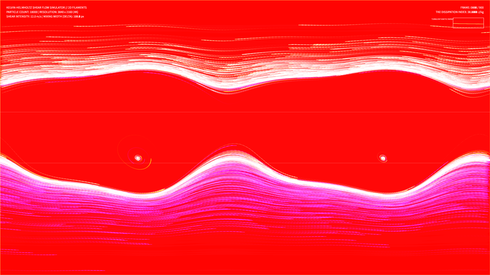

# kinetic_kelvin_helmholtz_shear_2d

## Metadata
- **Date**: 2026-08-14
- **Theme**: The delicate curling of two opposing wind currents meeting in the dark, forming transient spirals before dissolving into turbulence.
- **Technique**: Kelvin-Helmholtz shear flow advection.
- **Logic Lab Reference**: None

## Concept
A visualization of shear flow instabilities at the boundary of two fluid layers moving at different speeds. The top layer moves to the right, carrying bioluminescent amber-gold currents, while the bottom layer moves to the left, carrying deep cobalt-teal currents. As they slide past each other, small wave perturbations quickly grow, roll up into spiral scrolls, stretch out, and eventually break apart into rich turbulent structures. The mixing layer glows in electric rose where the currents collide and transition.

## Technical Details
- **Renderer**: P2D
- **Simulation**: Vectorized advection using tanh shear velocity profiling and multi-frequency sin/cos perturbation fields.
- **Visuals**: HSB spectral mapping modulated by advection speed, additive blending (`py5.ADD`), and low-alpha trails for persistent volumetric mixing history.
- **Animation**: 15 seconds @ 60fps (900 frames total). Includes real-time Turbulence Kinetic Energy (TKE) telemetry graphs.
