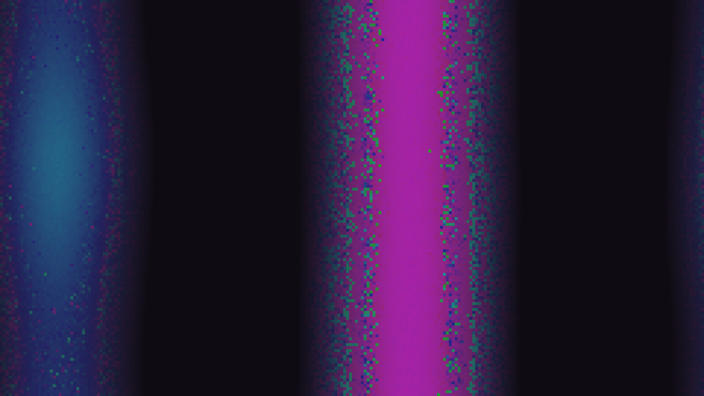

# kinetic_kuramoto_chimera_states_2d

## Metadata
- **Date**: 2026-08-30
- **Theme**: Coexistence of order and chaos, synchronization, non-local coupled oscillators, chimera states.
- **Technique**: Vectorized 2D Kuramoto coupled oscillator simulation with non-local coupling and phase lag. Utilizes 2D FFT convolutions in NumPy to evaluate coupling fields, and maps local order parameters to HSL color saturation and lightness.
- **Logic Lab Reference**: None

## Concept
A visualization of Kuramoto Chimera States—a mathematical phenomenon where identical coupled oscillators spontaneously separate into coexisting domains of perfect synchronization and complete phase chaos. Glowing islands of coherent waves (order) emerge and slowly rotate within a dim, sparkling sea of asynchronous noise (chaos). The color gradients reflect the phase mapping, presenting a visual metaphor for the fragile boundary between order and chaos in complex dynamical systems.

## Technical Details
- **Renderer**: P2D
- **Simulation**: Vectorized NumPy coupled oscillator integration. Non-local spatial coupling modeled via precomputed 2D FFT convolution of complex phase values with an exponential decay kernel.
- **Visuals**: HSL-to-RGB conversion where Hue corresponds to phase angle, and local synchronization (magnitude of order parameter $R = |W|$) determines saturation and brightness, isolating coherent structures from chaotic backgrounds.
- **Animation**: 15 seconds @ 60fps
