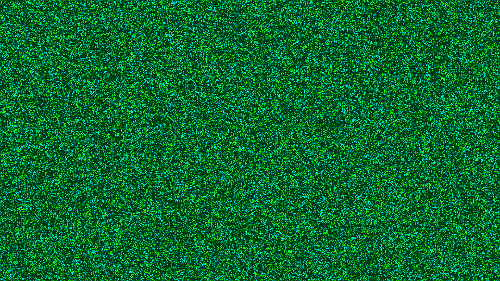

# kinetic_kuramoto_coupled_oscillators_2d

## Metadata
- **Date**: 2026-07-25
- **Theme**: A vast swarm of bioluminescent fireflies slowly falling into hypnotic synchronization.
- **Technique**: Kuramoto model of coupled oscillators on a 2D spatial grid, complex-number neighborhood convolution, vectorized HSB-to-RGB rendering.

## Concept
This work simulates the Kuramoto model of coupled oscillators across a dense spatial grid, visualizing the emergent phenomenon of spontaneous synchronization. Each grid cell is an independent oscillator with its own natural frequency drawn from a Gaussian distribution. Oscillators are coupled to their eight nearest neighbors via the standard Kuramoto interaction term. Initially the entire grid is in a state of incoherence — oscillators fire at random phases, producing a fine-grained noise of flickering green light. Over time, local coupling nudges neighboring cells toward phase agreement, and coherent domains begin to nucleate and grow. These synchronized patches expand outward as traveling waves of bioluminescent color, eventually spanning the canvas in sweeping arcs of coordinated light — a computational analogue of fireflies falling into synchrony at dusk.

## Technical Details
- **Renderer**: P2D (direct pixel manipulation via `np_pixels`)
- **Simulation**: Kuramoto model on a `(270 × 480)` grid (4px per cell at 1920×1080). Phase update: `θ += ω + K · Im(Σ exp(iθ_neighbor) · exp(−iθ))`. Coupling constant `K = 0.8`.
- **Neighborhood**: 8-cell Moore neighborhood computed via cyclic `np.roll` shifts — no explicit convolution kernel required.
- **Color Encoding**: Phase `θ ∈ [0, 2π]` mapped to hue range Lime Green → Cyan (HSB 0.3–0.5). Brightness pulsed as `cos(θ)^4` so each oscillator flashes at the peak of its cycle.
- **Rendering**: Fully vectorized NumPy HSB → RGB conversion using `np.choose` over the six HSB sectors; upscaled to screen resolution with `np.repeat`.
- **Animation**: 15 seconds (900 frames) @ 60 FPS.
