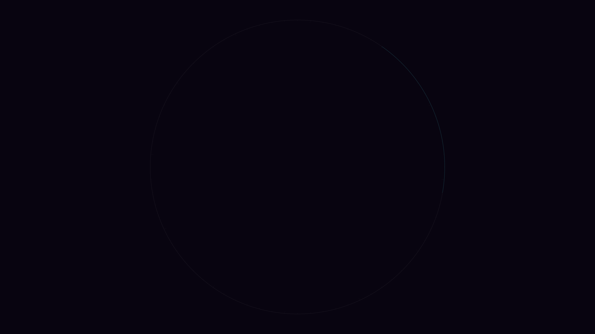

# kinetic_lenia_petri_dish_2d

## Metadata
- **Date**: 2026-08-02
- **Theme**: Artificial life, continuous space cellular automata, laboratory HUD graphics
- **Technique**: Fast Fourier Transform (FFT) convolution, continuous growth mapping, offscreen image projection, vector glass rendering.
- **Logic Lab Reference**: [lenia.py](file:///Users/asami/develop/art/logic-lab/src/logic_lab/reaction_diffusion/lenia/lenia.py)

## Concept
This work simulates the self-organization and motion of continuous artificial life inside an illuminated digital petri dish.
The simulation implements Lenia (a continuous generalization of Conway's Game of Life) using the "Orbium" preset. A localized random seeding of activity in the center initializes the cells, which naturally organize into self-sustaining, swimming gliders that crawl across the petri dish.
The activity field is rendered using an offscreen buffer upscaled to 4K with bilinear filtering, mapping densities to a cyber-biological color gradient: deep amethyst space void -> electric violet -> glowing cyan -> solar amber hot cores.
The petri dish is detailed with technical vector HUD elements, including concentric glass reflection rings, central axes, and measurement ticks around the perimeter. In the final phase, the lifeforms slowly wither and dissolve back into the void, creating a clean loop.

## Technical Details
- **Renderer**: Java2D
- **Simulation**: 256x256 grid, updated using Fast Fourier Transform (`np.fft.fft2` convolution) for real-time continuous neighborhood mapping on the CPU.
- **Visuals**: Bilinear upscaling to 4K, vector HUD overlays.
- **Animation**: 15 seconds @ 60 FPS (900 frames)
