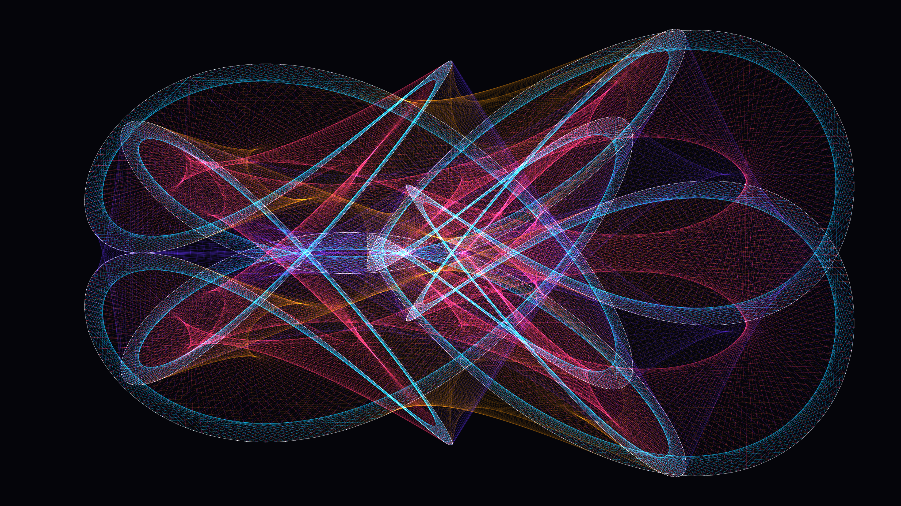

# kinetic_lissajous_web_2d

## Metadata
- **Date**: 2026-06-28
- **Theme**: A highly complex, glowing neon web woven by 800 interacting nodes moving along overlapping Lissajous
- **Technique**: A massive array of 800 nodes uses purely trigonometric positional updates (`x = A sin(a*t + d)`). In each frame, a 800x800 distance squared matrix is computed using NumPy broadcasting. A dynamic threshold mask extracts all proximal node pairs, returning interlaced coordinates. These are dumped entirely into a single `py5.vertices(points)` call with `LINES` geometry type, making 4K rendering incredibly fast despite checking 640,000 potential connections per frame. Additive blending combined with low opacity trailing rectangles gives the web a luminous neon glow.
- **Logic Lab Reference**: 

## Concept
A highly complex, glowing neon web woven by 800 interacting nodes moving along overlapping Lissajous curves. The nodes leave glowing light trails as they continuously spin and connect to one another.

## Technical Details
- **Renderer**: Unknown
- **Simulation**: Unknown
- **Visuals**: Unknown
- **Animation**: Contains animation details
