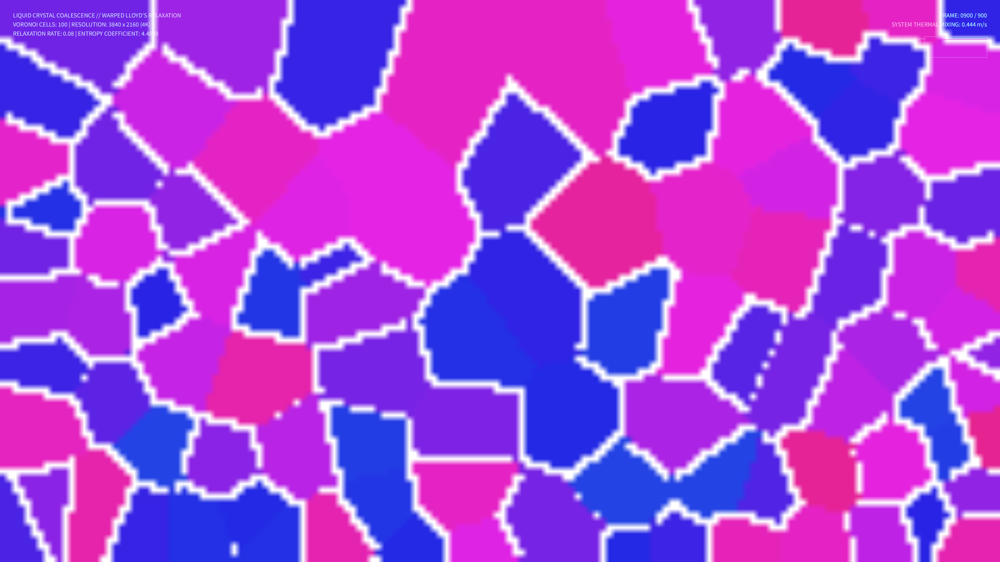

# kinetic_lloyd_liquid_crystal_2d

## Metadata
- **Date**: 2026-08-14
- **Theme**: The slow, crawling rearrangement of organic membranes in a liquid crystal sheet, sliding and relaxing under thermal currents.
- **Technique**: Warped Lloyd's Voronoi relaxation.
- **Logic Lab Reference**: None

## Concept
A computational visualization of Voronoi dynamics modeling organic cellular membranes. A set of 100 seeds is driven by a pseudo-fluid vector field consisting of two dynamic vortices while simultaneously undergoing centroid-directed Lloyd's relaxation. The resulting cell assignments are calculated on a grid to extract the high-contrast cellular boundaries. This creates a liquid-crystal honeycomb grid that stretches, splits, and flows organically, shifting in a bioluminescent color palette of teal, amethyst, and amber gold.

## Technical Details
- **Renderer**: P2D
- **Simulation**: Dual-vortex vector field advection and Lloyd's relaxation, calculated on a 160x90 grid and upscaled to 4K using bilinear interpolation.
- **Visuals**: HSB hue modulation over time, Sobel/Laplacian gradient edge detector for cell walls, and custom color mappings.
- **Animation**: 15 seconds @ 60fps (900 frames total). Includes real-time Cell Size Entropy calculation and tracking HUD.
