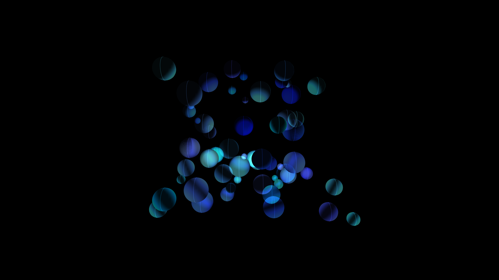

# kinetic_luminescent_glass_spheres_3d

## Theme
An array of fragile, luminescent glass spheres colliding in slow motion in a zero-gravity environment, refracting light through their surfaces.

## Technique
3D spheres with highly specular materials and low opacity, bouncing off each other within a bounding box. A moving point light creates sharp reflections.

## Palette
- Background: Pitch black
- Dominant: Transparent deep blue
- Secondary: Transparent cyan
- Accent: Bright white specular highlights

## Preview

