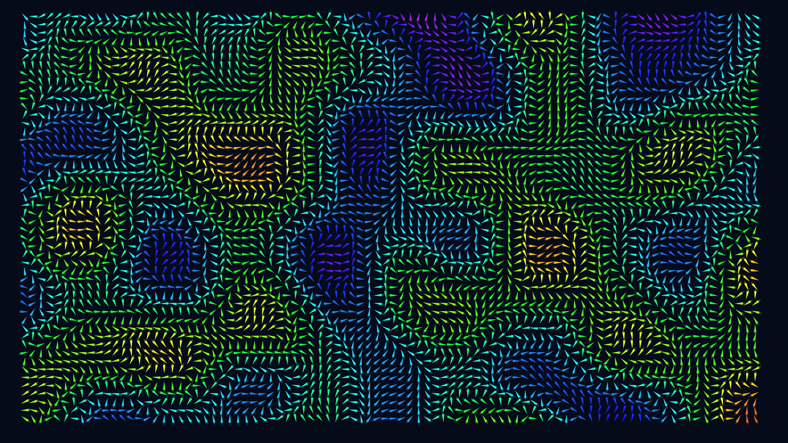

# kinetic_magnetic_compass_array_2d

## Metadata
- **Date**: 2026-06-26
- **Theme**: Generative Art
- **Technique**: 2D point grid where each point represents the anchor of a compass needle. A 3D noise vector field (where the third dimension is time) determines the angle of the compasses, creating sweeping, colorful waves across the grid. Rendered in default Java2D engine for compatibility.
- **Logic Lab Reference**: 

## Concept
No concept description provided.

## Technical Details
- **Renderer**: Unknown
- **Simulation**: Unknown
- **Visuals**: Unknown
- **Animation**: Unknown
