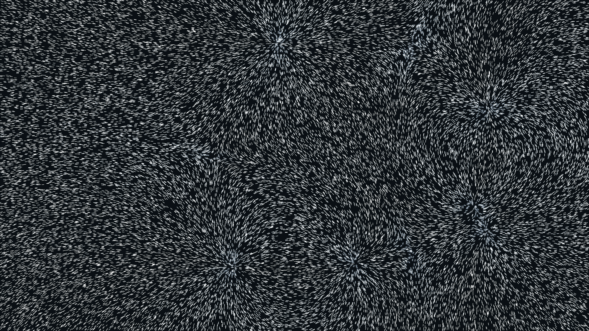

# kinetic_magnetic_field_iron_filings_2d

## Metadata
- **Date**: 2026-06-28
- **Theme**: An intricate, magical simulation of 40,000 tiny iron filings constantly rotating and aligning themse
- **Technique**: Three "North" poles and three "South" poles orbit each other invisibly in the center of the canvas. These poles are driven by seamless looping Lissajous patterns with a touch of Perlin noise. The canvas is filled with 40,000 iron filing points. For every frame, the exact 2D magnetic field vector is computed at every point by summing the forces from all 6 poles using the inverse-square law ($F = \frac{1}{r^2}$). To ensure optimal performance, this massive calculation is fully vectorized using NumPy. The filings do not move their positions; instead, they simply rotate in place like tiny compass needles to trace the invisible magnetic flux lines.
- **Logic Lab Reference**: 

## Concept
An intricate, magical simulation of 40,000 tiny iron filings constantly rotating and aligning themselves to an invisible kinetic magnetic field.

## Technical Details
- **Renderer**: Unknown
- **Simulation**: Unknown
- **Visuals**: Unknown
- **Animation**: Contains animation details
