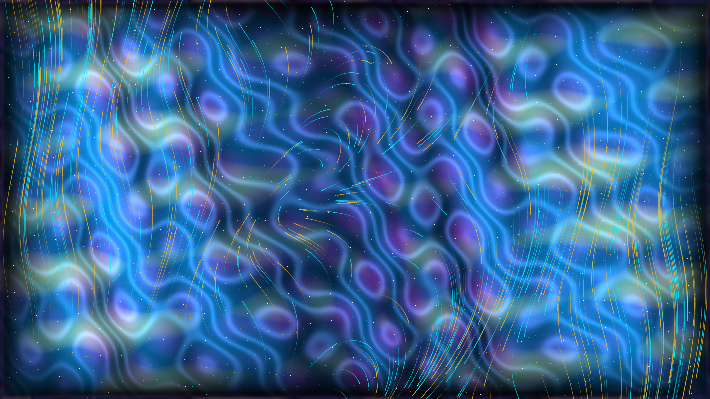

# kinetic_magnetorotational_mri_turbulence_2d

Kinetic 2D magnetohydrodynamic (MHD) simulation of the Balbus-Hawley Magnetorotational Instability (MRI) and accretion disk dynamo turbulence around a compact astrophysical object.

## Concept & Scientific Background

The Magnetorotational Instability (discovered in astrophysical context by Steven Balbus and John Hawley in 1991) resolves one of the fundamental paradoxes of high-energy astrophysics: how accretion disks around black holes, neutron stars, and protostars transfer angular momentum outward to allow matter to fall inward.

1. **Failure of Classical Hydrodynamics & The Magnetic Spring**:
   In a Keplerian differentially rotating disk, angular velocity decreases with radius ($\frac{d\Omega}{dr} = -\frac{3}{2}\frac{\Omega}{r} < 0$), while specific angular momentum increases ($\frac{d(r^2\Omega)}{dr} > 0$). According to Rayleigh's hydrodynamic stability criterion, such disks are completely stable against axisymmetric perturbations. However, Balbus and Hawley demonstrated that even a vanishingly weak magnetic field acts as a tethering spring connecting radially adjacent fluid parcels:
   - The inner fluid parcel orbits faster and stretches the magnetic tether forward.
   - Magnetic tension exerts a decelerating backward torque on the inner parcel, stripping its angular momentum and causing it to plunge inward toward the central black hole.
   - The outer parcel receives this angular momentum, moving outward.
   - This positive feedback loop triggers exponential destabilization at a dynamic growth rate $\gamma_{max} = \frac{3}{4}\Omega$.

2. **Channel Flows to Fully Developed MHD Turbulence**:
   In the linear growth phase, unstable modes organize into coherent, radially alternating streams known as **channel flows**. As their amplitude grows, these channel streams become unstable to secondary parasitic Kelvin-Helmholtz and magnetic tearing-mode instabilities, rapidly breaking down into vigorous, self-sustaining MHD turbulence and turbulent dynamo action.

3. **Maxwell Stresses & Ohmic Dissipation**:
   The primary driver of outward angular momentum transport is the turbulent **Maxwell stress tensor**:
   $$M_{xy} = -\frac{\langle B_x B_y \rangle}{4\pi} > 0$$
   The correlated stretching of radial and azimuthal magnetic field vectors produces persistent positive stress that heats the accretion plasma through viscous and ohmic dissipation (rendered as incandescent solar gold and amber fire).

4. **Magnetic Reconnection Current Sheets**:
   Oppositely directed magnetic flux ropes are continuously sheared together by the Keplerian flow, driving intense magnetic reconnection along localized current sheets:
   $$J_z = (\nabla \times \mathbf{B})_z = \frac{\partial B_y}{\partial x} - \frac{\partial B_x}{\partial y}$$
   These reconnection sites violently convert magnetic energy into thermal plasma radiation and relativistic particle acceleration (rendered as beaming laser magenta and ultraviolet filaments).

5. **Blinn-Phong Specular Plasma Sheen**:
   Dynamic surface height fields derived from magnetic pressure ridges ($P_{mag} = B^2 / 8\pi$) and current sheets produce dual-source Blinn-Phong specular reflections (liquid platinum and diamond chrome).

## Color Palette

- **Midnight Obsidian** (`#020412`): Non-radiating accretion disk void.
- **Electric Cyan** (`#00f0ff`): High-energy coherent magnetic flux ropes.
- **Solar Gold & Amber Fire** (`#ffaa00`): Maxwell stress angular momentum transport and ohmic dissipation zones.
- **Laser Magenta & Royal Violet** (`#ff0080`): Magnetic reconnection current sheets and tearing modes.
- **Platinum Diamond White** (`#ffffff`): Relativistic synchrotron lepton sparks and Blinn-Phong specular highlights.

## Technical Specifications

- **Resolution**: 1920 × 1080 (16:9 widescreen)
- **Frame Rate**: 60 FPS
- **Duration**: 900 frames (15.0 seconds seamless periodic loop)
- **Engine**: py5 (Processing for Python) in P2D mode with vectorized NumPy physics
- **Video Output**: H.264 MP4 (`yuv420p`, CRF 18) via automatic ffmpeg assembly
