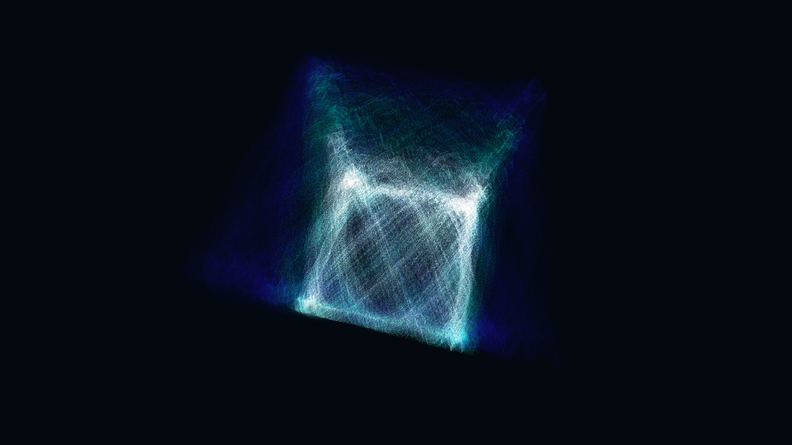

# kinetic_math_spirograph_lissajous_3d

## Metadata
- **Date**: 2026-07-01
- **Theme**: An intricate, kinetic 3D spirograph consisting of a thick ribbon woven from thousands of individual 
- **Technique**: Unknown
- **Logic Lab Reference**: 

## Concept
An intricate, kinetic 3D spirograph consisting of a thick ribbon woven from thousands of individual geometric strands, forming complex Lissajous knots that continuously morph and re-weave themselves.

## Technical Details
- **Renderer**: Unknown
- **Simulation**: Unknown
- **Visuals**: Unknown
- **Animation**: Contains animation details
