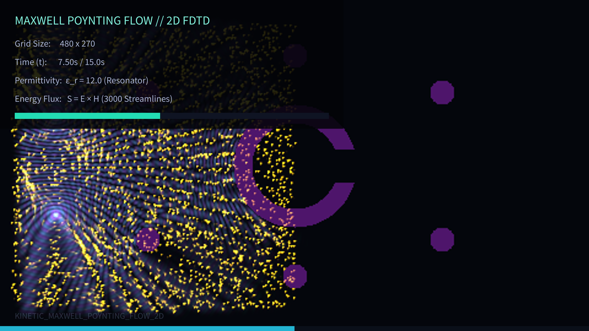

# kinetic_maxwell_poynting_flow_2d

A 4K kinetic visualization of electromagnetism, solving the 2D Maxwell's equations in real-time and mapping the Poynting vector field (representing energy flux) to the motion of advected streamline particles.

## Concept

This sketch simulates transverse magnetic (TM) polarized electromagnetic waves propagating and scattering around a central dielectric split-ring resonator (permittivity $\epsilon_r = 12.0$) and a lattice of smaller satellite scatterers. 

The electric field $E_z$ propagates outward from two out-of-phase point sources on the left. As the wave fronts collide with the obstacles, they undergo complex reflection, refraction, and focusing caustics. The instantaneous energy flux is computed via the Poynting vector:

$$\mathbf{S} = \mathbf{E} \times \mathbf{H}$$

which in TM polarization reduces to:

$$S_x = -E_z H_y, \quad S_y = E_z H_x$$

A swarm of 3,000 advected particles trace the streamlines of this energy flow. The particles vibrate slightly with the wave's instantaneous oscillations while flowing smoothly along the time-averaged Poynting vector direction.

## Technical Details

- **Physics Solver**: Vectorized 2D Transverse Magnetic (TM) Finite-Difference Time-Domain (FDTD) Maxwell solver using NumPy. Courant factor $C = 0.5$.
- **Absorbing Boundaries**: Edge damping layer to absorb waves and prevent wall reflections.
- **Visuals**: Electric field phase mapped to Teal (positive) and Indigo (negative). Poynting streamlines colored in glowing warm amber.
- **Output**: 900 frames compiled using FFmpeg into a 15-second 60fps video at 4K resolution.
