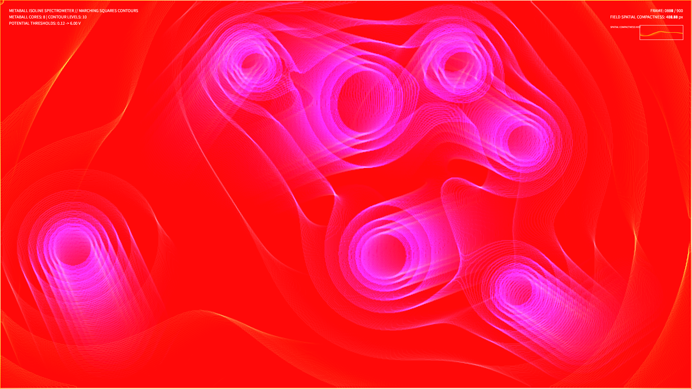

# kinetic_metaball_contours_2d

## Metadata
- **Date**: 2026-08-14
- **Theme**: An undulating topological map of a shifting gravitational field, traced in glowing rings of neon light that merge and separate.
- **Technique**: Topographic Marching Squares metaballs.
- **Logic Lab Reference**: None

## Concept
A computational geometry and field topology visualization. The system models 8 moving metaball particles bouncing within a 2D box, calculating their combined potential field on a grid. A sub-grid contour extraction (Marching Squares equivalent via OpenCV) computes 10 distinct potential isolines. These isolines are rendered as glowing, additive, color-coded rings, mapping the field potential level to HSB hue gradients (violet to cyan to mint). When metaballs merge, their isolines dynamically warp and fuse.

## Technical Details
- **Renderer**: P2D
- **Simulation**: Vectorized potential field calculations in NumPy, combined with contour extraction in OpenCV.
- **Visuals**: Gradient stroke-weight isoline rendering, HSB hue potential mapping, additive blending (`py5.ADD`), and low-alpha screen clearing for fluid motion trails.
- **Animation**: 15 seconds @ 60fps (900 frames total). Includes real-time Field Spatial Compactness telemetry HUD.
