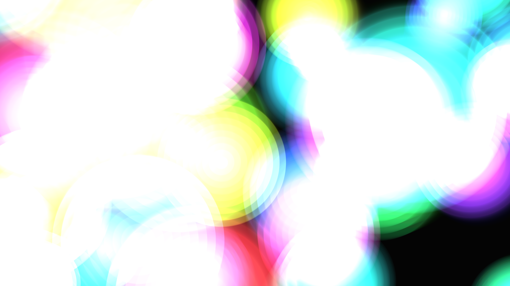

# kinetic_metaball_plasma_2d

## Metadata
- **Date**: 2026-06-30
- **Theme**: A glowing plasma simulation using dynamic metaballs
- **Technique**: Unknown
- **Logic Lab Reference**: 

## Concept
A glowing plasma simulation using dynamic metaballs. Bouncing particles merge and interact with each other in an organic way, with their colors shifting continuously through the neon spectrum to create a vibrant fluid effect.

## Technical Details
- **Renderer**: Unknown
- **Simulation**: Unknown
- **Visuals**: Unknown
- **Animation**: - `kinetic_metaball_plasma_2d.mp4` - `kinetic_metaball_plasma_2d_p1.png`
