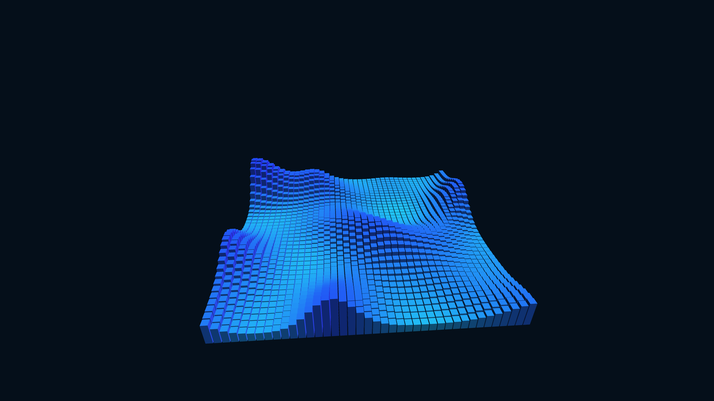

# kinetic_metallic_piston_ocean_3d

A dense, metallic array of geometric cubes acting as a piston engine, moving up and down continuously based on a multi-scale Perlin noise field, resembling a hyper-advanced metallic ocean.

## Technique

3D cubes drawn in a grid. Their heights and colors are dynamically driven by 3D OpenSimplex noise. Complex directional and ambient lighting creates a metallic, mechanical look.
