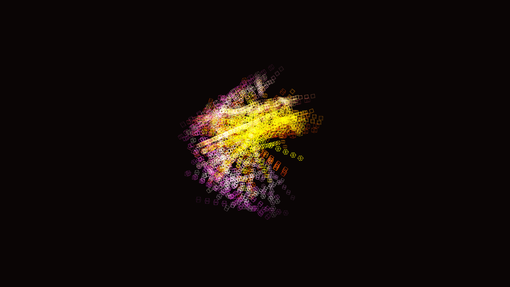

# kinetic_metropolis_clockwork_cube_3d

## Metadata
- **Date**: 2026-06-08
- **Theme**: Generative Art
- **Technique**: A 3D grid array of cubes. Sub-sections (rows, columns, planes) of the array randomly rotate around their local axes in 90-degree increments, smoothly animated with sine-easing.
- **Logic Lab Reference**: 

## Concept
No concept description provided.

## Technical Details
- **Renderer**: Unknown
- **Simulation**: Unknown
- **Visuals**: Unknown
- **Animation**: [kinetic_metropolis_clockwork_cube_3d_p1.png](kinetic_metropolis_clockwork_cube_3d_p1.png)
