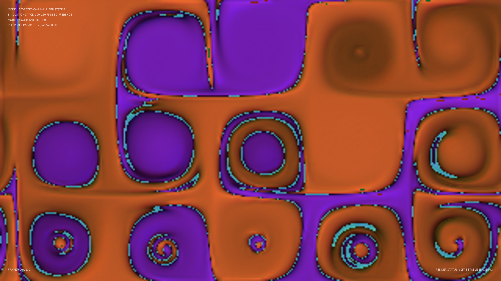

# kinetic_microemulsion_cahn_hilliard_2d

## Metadata
- **Date**: 2026-08-20
- **Theme**: Bioluminescent phase-separated microemulsion membranes fluctuating and self-assembling in a chemical fluid cavity.
- **Technique**: Swift-Hohenberg phase-field simulation coupled with multi-scale drift flow advection and specular normal shading.
- **Logic Lab Reference**: None

## Concept
A visualization of lipid-like self-assembling bicontinuous interfaces in a ternary fluid mixture. By utilizing a modified Swift-Hohenberg phase-field operator (which mathematically mimics the energy profiles of water-oil-surfactant mixtures), this artwork renders detailed vesicular bubbles and labyrinthine channels. The interfaces dynamically morph, split, and synchronize under a pseudo-turbulent drift flow.

## Technical Details
- **Renderer**: P2D
- **Simulation**: Vectorized 2D fourth-order Swift-Hohenberg solver coupled with a semi-Lagrangian advection drift flow integrated in NumPy.
- **Visuals**: Normal-mapped Blinn-Phong specular shading, glowing phase interfaces, and glassmorphic technical telemetry.
- **Animation**: 20 seconds @ 60fps
