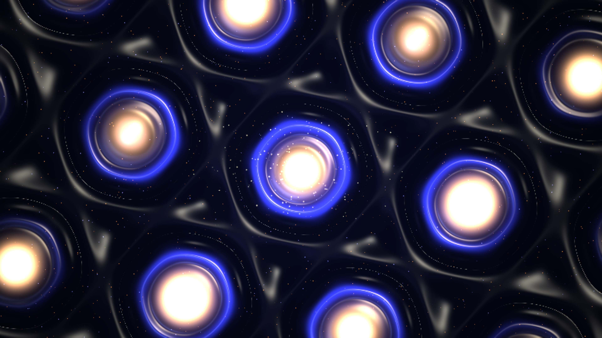

# kinetic_moire_flat_band_superlattice_2d

2D quantum condensed matter simulation of **Moiré Flat Bands** and **Topological Soliton Superlattices** in twisted bilayer systems.

## Concept

When two hexagonal 2D crystal monolayers (such as graphene or transition metal dichalcogenides) are overlaid with a small twist angle $\theta$ (the magic angle $\theta \approx 1.08^\circ$), a macroscopic Moiré superlattice emerges with periodicity $L_M = \frac{a}{2 \sin(\theta/2)}$.

In this flat-band regime, kinetic energy is quenched, forcing electrons to condense into localized quantum dots at the **AA-stacking** registry nodes while forming a chiral network of topological domain-wall solitons separating the **AB** and **BA** stacking domains.

This piece simulates:
- **Dynamic Moiré Scale Breathing**: Continuous harmonic modulation of the twist angle $\theta(t)$, causing the superlattice period $L_M(t)$ to expand and contract across the canvas.
- **AA-Stacking Local Density of States (LDOS)**: Extreme wavepacket localization forming radiant molten copper and rose gold quantum dot islands.
- **Topological Domain-Wall Network**: Hexagonal sapphire and electric iris boundaries carrying chiral soliton currents between AA nodes.
- **3D Blinn-Phong Specular Relief Shading**: Dual-light normal shading creating glossy liquid chrome and metallic copper reflections.
- **Lagrangian Moiré Particles**: Trapped quantum excitons swirling within AA quantum dots, domain-wall solitons gliding along boundaries, and interlayer tunneling bursts.

## Specifications

- **Format**: 4K 60fps Animation (900 frames, 15 seconds)
- **Palette**:
  - Background (60%): Graphene Substrate Obsidian Void & Deep Carbon Indigo (`#03050c`, `#080c1d`)
  - Dominant (60% of foreground): AA-Stacking Flat-Band Resonance, Molten Copper & Warm Rose Gold (`#f97316`, `#fb923c`, `#ea580c`)
  - Secondary (30% of foreground): Topological Domain-Wall Sapphire & Electric Iris Violet (`#6366f1`, `#818cf8`)
  - Accent (10% of foreground): Incandescent AA Quantum Dot Core Diamond-White & Solar Platinum (`#ffffff`, `#fef08a`)
- **Resolution**: 3840×2160 (Output) / 1920×1080 (Preview)
