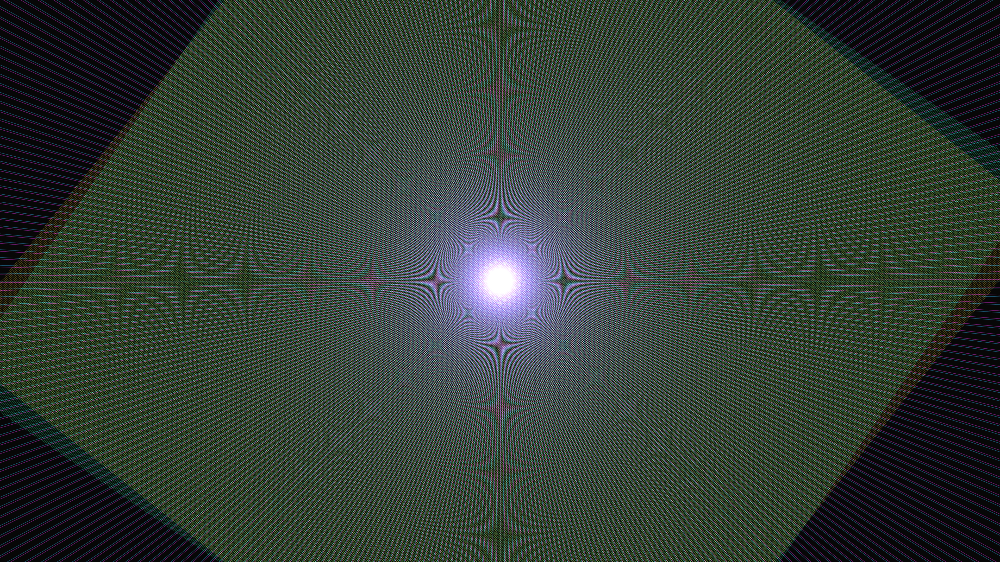

# kinetic_moire_interference_patterns_2d

## Metadata
- **Date**: 2026-06-20
- **Theme**: Two overlapping sets of dense, thin lines rotating to create mesmerizing moiré patterns
- **Technique**: Unknown
- **Logic Lab Reference**: 

## Concept
Two overlapping sets of dense, thin lines rotating to create mesmerizing moiré patterns.

## Technical Details
- **Renderer**: Unknown
- **Simulation**: Unknown
- **Visuals**: Unknown
- **Animation**: Contains animation details
