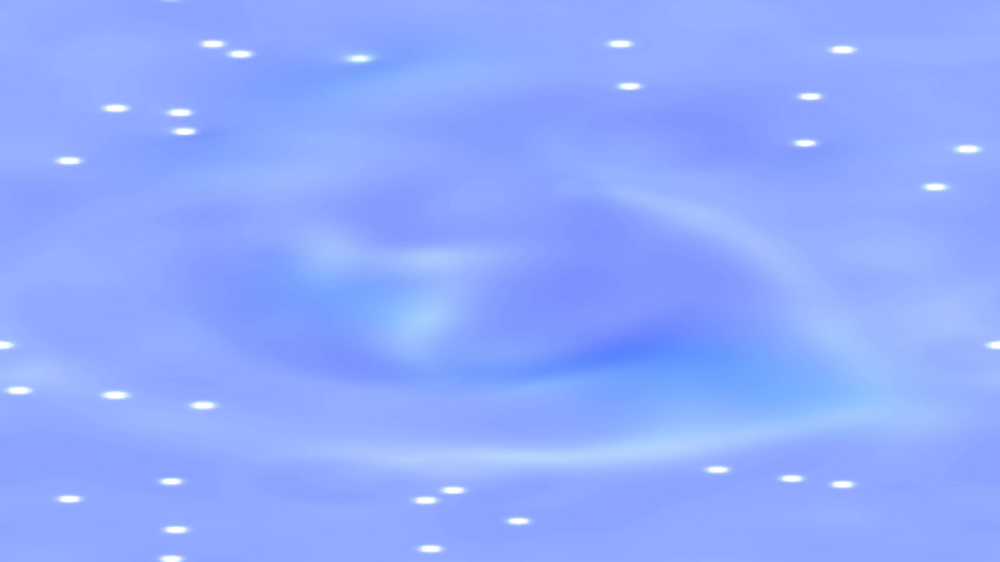

# kinetic_multiphase_lattice_boltzmann_2d

## Metadata
- **Date**: 2026-08-17
- **Theme**: Immiscible bioluminescent droplets swirling and merging under shear stress in a chaotic microscopic abyss.
- **Technique**: Vectorized 2D Shan-Chen multiphase Lattice Boltzmann Method (LBM) solver in NumPy, and a Blinn-Phong specular liquid surface shader.

## Concept
This artwork simulates the micro-dynamics of two immiscible fluid phases (represented by amethyst purple and solar coral orange) separating under surface tension forces (repulsion) while being stirred by orbiting vortices. The boundary between the two fluids is highlighted as a glowing turquoise interface. Using a custom specular reflection map, the fluid blobs take on a glossy, three-dimensional appearance, resembling bubble-like emulsions in a dark ocean void.

## Technical Details
- **Renderer**: Py5 default (updated pixel buffer directly)
- **Simulation**: Shan-Chen multiphase D2Q9 Lattice Boltzmann Method solver in NumPy with dynamic vortex forcing and velocity clipping.
- **Visuals**: Vectorized color blending based on phase densities, boundary interface detection, and specular Blinn-Phong lighting.
- **Animation**: 15s @ 60fps
