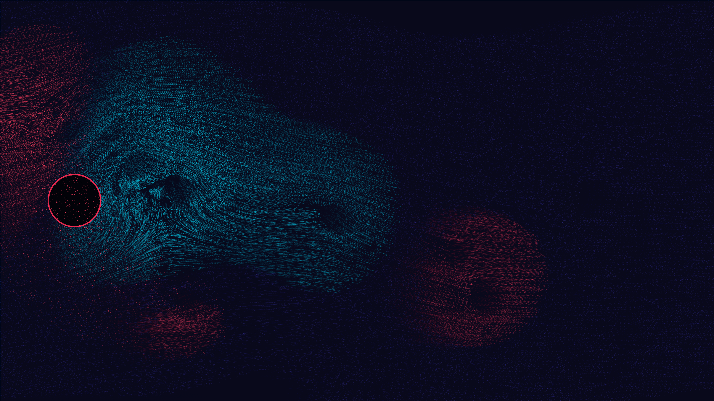

# kinetic_navier_stokes_karman_vortex_street_2d

A 4K generative media art animation visualizing a **Kármán Vortex Street** flow field — the beautiful, alternating swirling vortices that shed from a cylindrical obstacle in a fluid stream.

## Concept

When a fluid flows past a blunt body, the boundary layer separates and rolls up into individual vortices. These vortices are shed alternately from both sides of the body, forming a repeating pattern of swirling structures known as a Kármán Vortex Street. This artwork simulates this phenomenon using analytical potential flow theory coupled with discrete vortex shedding. 40,000 trace particles are advected through the velocity field, mapping the flow trajectories.

## Technical Details

- **Framework**: py5 (Processing for Python) + NumPy
- **Physics**: 2D Potential flow around a cylinder of radius $R = 140$ at uniform background flow ($U_{\text{flow}} = 7.0$), coupled with a system of discrete shed point vortices that mutually induce velocity on each other.
- **Color Mapping**: Particles are dynamically colored based on their local **vorticity signature**. Clockwise vortices shed from the top are colored neon coral-magenta, counter-clockwise vortices shed from the bottom are colored electric cyan, and the laminar free-stream background is colored deep sapphire-indigo.
- **Resolution**: 3840×2160 (4K UHD), 60 FPS, 15-second loop (900 frames)
