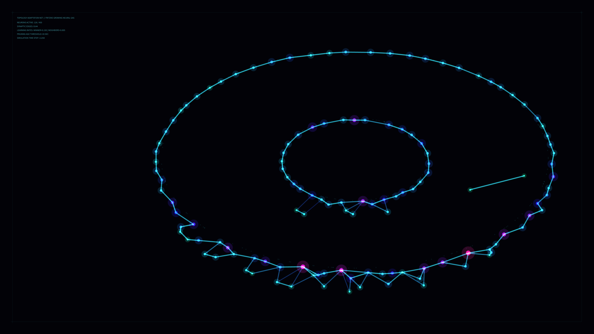

# kinetic_neural_gas_emergence_2d

## Metadata
- **Date**: 2026-08-02
- **Theme**: Competitive neural learning, self-organizing systems, topological networks, vector cybernetics
- **Technique**: Growing Neural Gas (Fritzke GNG) algorithm, dynamic multi-ring sample distribution, age-based edge color mapping, error-reactive bioluminescent node scaling, laboratory HUD framing.
- **Logic Lab Reference**: [growing_neural_gas.py](file:///Users/asami/develop/art/logic-lab/src/logic_lab/self_organizing/growing_neural_gas/growing_neural_gas.py)

## Concept
This piece visualizes the competitive learning process of an artificial Growing Neural Gas (GNG) network.
Unlike static configurations, the target data distribution consists of concentric rings that rotate, orbit, and expand over time. The neural network starts with just two nodes and dynamically grows, inserting new neurons in high-error regions and pruning old connections.
The connections are colored by age: young edges glow bright neon cyan, while older edges fade to deep violet. The nodes represent learning states, shifting from magenta (high error/active learning) to emerald green (stable representation) with a soft outer bioluminescent glow.
A technical HUD overlays the 4K canvas, displaying telemetry parameters such as neuron count, connection edges, and simulation step count. In the final phase, the age limit drops to 1, causing the synaptic network to fragment and dissolve back into the dark void for a perfect looping transition.

## Technical Details
- **Renderer**: Java2D
- **Simulation**: Fritzke GNG graph network. Evaluates 25 updates per frame, adapting up to 450 nodes and their edges to a dynamic bivariate distribution.
- **Visuals**: HSB age-based edges, error-reactive two-pass node drawing, vector corner crosses, and parameters readout.
- **Animation**: 15 seconds @ 60 FPS (900 frames)
