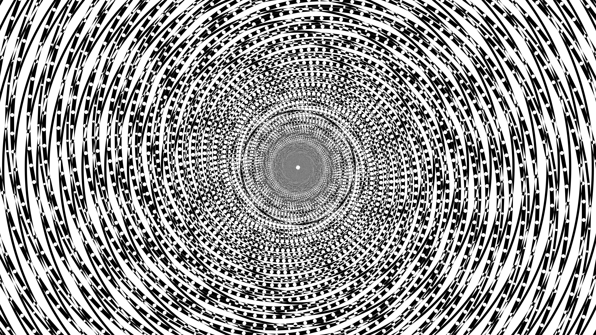

# kinetic_op_art_interference_spiral_2d

## Metadata
- **Date**: 2026-06-14
- **Theme**: An animated 15s sequence showing high-contrast black and white spirals overlapping to form a mesmeri
- **Technique**: 2D drawing of thick, precise black and white vector graphics. Multiple rotating layers of logarithmic spirals and concentric circles. Uses `py5.blend_mode(py5.DIFFERENCE)` to create intense moiré interference patterns as the layers counter-rotate.
- **Logic Lab Reference**: 

## Concept
An animated 15s sequence showing high-contrast black and white spirals overlapping to form a mesmerizing, pulsating optical illusion.

## Technical Details
- **Renderer**: Unknown
- **Simulation**: Unknown
- **Visuals**: Unknown
- **Animation**: Unknown
