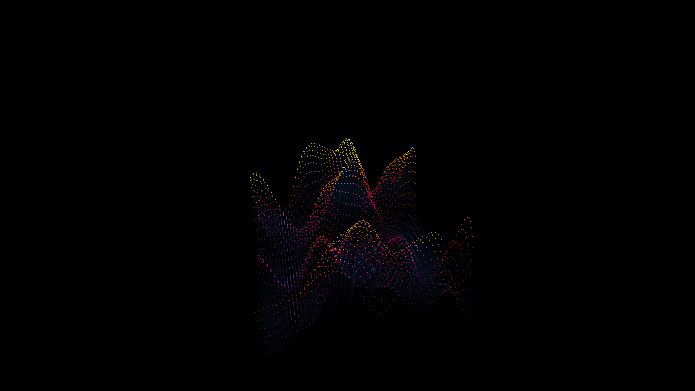

# kinetic_optical_fiber_wave_3d

## Metadata
- **Date**: 2026-05-31
- **Theme**: An immersive 3D wave composed of thousands of glowing optical fiber tips, sweeping gracefully over a
- **Technique**: A 2D grid of `py5.line` elements stretching upwards. The height (y-coordinate) of the top vertex is driven by a 2D Perlin noise map that scrolls over time. The tips are drawn with additive blended `py5.points` to simulate glowing ends of optical fiber.
- **Logic Lab Reference**: 

## Concept
An immersive 3D wave composed of thousands of glowing optical fiber tips, sweeping gracefully over an invisible terrain.

## Technical Details
- **Renderer**: Unknown
- **Simulation**: Unknown
- **Visuals**: Unknown
- **Animation**: Unknown
