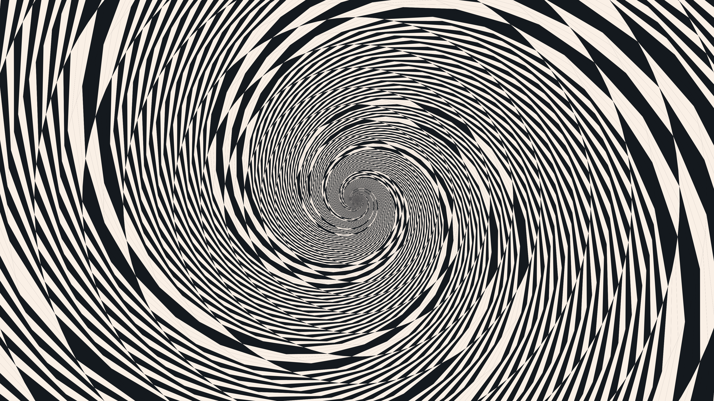

# kinetic_optical_illusion_droste_spiral_2d

## Metadata
- **Date**: 2026-07-01
- **Theme**: A mesmerising geometric animation leveraging complex conformal mapping to create a spiraling infinit
- **Technique**: Unknown
- **Logic Lab Reference**: 

## Concept
A mesmerising geometric animation leveraging complex conformal mapping to create a spiraling infinite tunnel (the Droste effect / Escher spiral).

## Technical Details
- **Renderer**: Unknown
- **Simulation**: Unknown
- **Visuals**: Unknown
- **Animation**: Contains animation details
