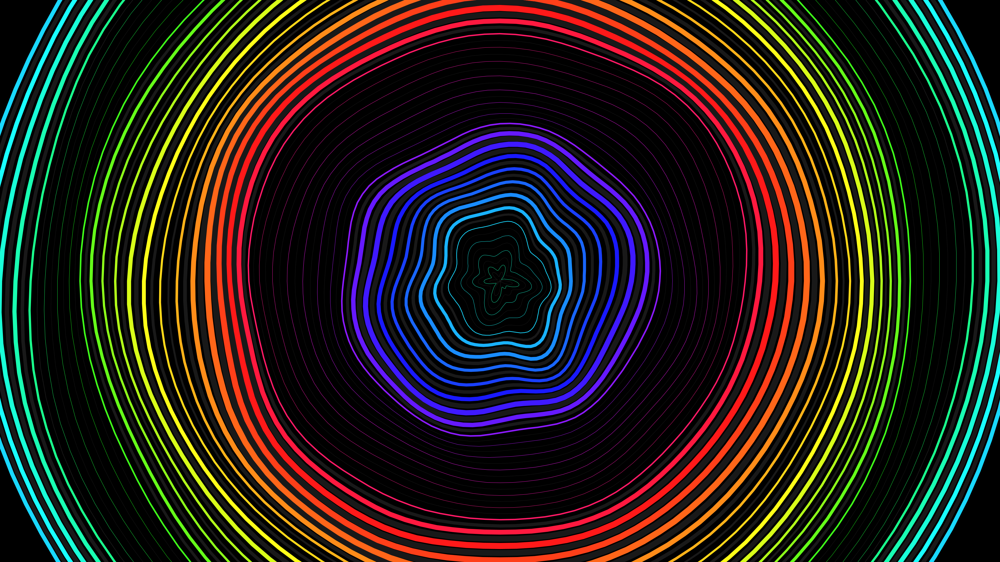

# kinetic_optical_illusion_waves_2d

## Metadata
- **Date**: 2026-06-20
- **Theme**: Optical illusion using expanding, contrasting concentric shapes that create a false sense of motion 
- **Technique**: Unknown
- **Logic Lab Reference**: 

## Concept
Optical illusion using expanding, contrasting concentric shapes that create a false sense of motion or depth.

## Technical Details
- **Renderer**: Unknown
- **Simulation**: Unknown
- **Visuals**: Unknown
- **Animation**: Contains animation details
