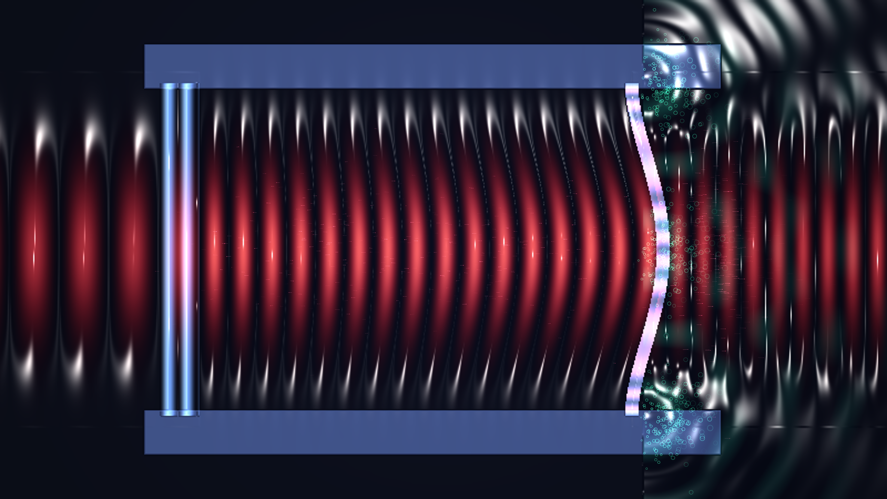

# kinetic_optomechanical_cavity_backaction_2d

A 15-second kinetic media art visualization of radiation-pressure dynamical backaction within a high-finesse optomechanical microcavity: self-sustained limit cycle mechanical oscillations, breathing optical standing waves, optical frequency comb sideband emission, and photoelastic stress birefringence.

## Concept & Physics

In cavity optomechanics, photons confined between reflective mirrors exert radiation pressure force on compliant mechanical elements (e.g. a micro-machined cantilever membrane).

When driven by a detuned continuous-wave laser, the coupled equations of motion govern the optical field amplitude $a(t)$ and mechanical displacement $x(t)$:
$$\dot{a} = -\left(i(\Delta_0 - g_0 x) + \frac{\kappa}{2}\right) a + \sqrt{\kappa_{in}} s_{in}$$
$$\ddot{x} + \Gamma_m \dot{x} + \Omega_m^2 x = \frac{\hbar g_0}{m} |a|^2$$

1. **Dynamical Backaction & Phonon Amplification**: In the blue-detuned regime ($\Delta_0 > 0$), the finite cavity photon lifetime $\tau \sim 1/\kappa$ creates a phase lag in radiation pressure relative to mirror velocity, producing negative mechanical damping. The membrane amplitude grows exponentially into a stable optomechanical limit cycle.
2. **Breathing Standing Waves & Resonance Bursts**: As the cantilever oscillates past the zero-detuning condition $g_0 x(t) \approx \Delta_0$, the intracavity field bursts into intense resonance, squeezing and expanding the optical standing wave lattice.
3. **Phononic Emission into Substrate**: The vibrating cantilever anchor emits coherent acoustic phonons (elastic waves) outward into the surrounding silicon chip substrate.
4. **Optical Frequency Comb Sidebands**: Phase modulation by mechanical motion generates discrete optical sidebands ($\omega_L \pm n \Omega_m$) leaking through the mirror interfaces as transmitted laser wavepackets.
5. **Photoelastic Birefringence**: High flexural stress at the cantilever clamping anchors induces polariscopic stress birefringence fringes.

## Visual Dynamics

- **Dielectric Bragg Mirrors**: Multilayer high-reflectivity mirror facets rendered with crisp glacial azure and chrome specular sheen.
- **Vibrating Cantilever Membrane**: Elastic flexural bending modes with rainbow photoelastic stress fringes at clamping joints.
- **Breathing Standing Waves**: Radiant ruby/crimson laser modes expanding and intensifying during resonance bursts.
- **Lagrangian Photons & Phonons**: Rapid laser photon packets bouncing within the cavity and escaping into free space, accompanied by expanding phosphor emerald acoustic phonon wavefronts in the substrate.

## Color Palette

- **Circulating Laser Field & Sidebands** (`#f82b60`, `#ff4575`, `#ff8a3d`): High-finesse laser beam in radiant ruby crimson, coherent rose, and incandescent amber (60%).
- **Micro-Fabrication Silicon & Mirrors** (`#dff4ff`, `#2d68f8`): Dielectric Bragg mirrors and substrate frames in glacial ice and electric sapphire (30%).
- **Phononic Wavefronts & Cavity Nodes** (`#36f4b0`, `#ffffff`): Acoustic phonons and specular resonance nodes in phosphor emerald mint and diamond-white (10%).
- **Cryogenic Vacuum Chamber** (`#04060e`): Deep non-reflective obsidian void.

## Technical Implementation

- **Platform**: py5 (Python Processing architecture)
- **Optomechanics Engine**: Coupled non-linear cavity detuning, Lorentzian transmission resonance, and flexural beam kinematics.
- **Optics & Shading**: 3D surface normal mapping $\vec{N} = (-\nabla \phi, 1.0)$ with dual-light Blinn-Phong specular reflections.
- **Particles**: Additive blended (`ADD`) Lagrangian photon packets, acoustic phonon rings, and mirror spark bursts.
- **Output**: 3840×2160 / 1920×1080 @ 60fps (900 frames, 15 seconds), H.264 video.
