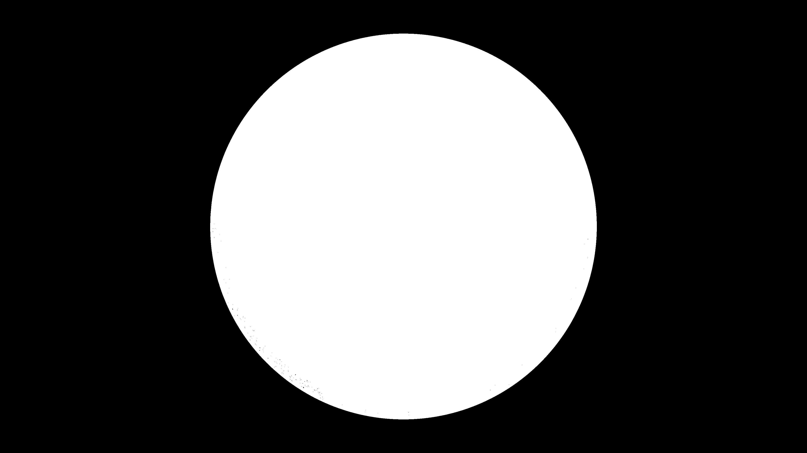

# kinetic_orbital_resonator_3d

## Metadata
- **Date**: 2026-05-24
- **Theme**: - **Format**: Animation (15s @ 60fps) - **Theme**: A delicate, hypnotic 3D kinetic sculpture of inte
- **Technique**: Unknown
- **Logic Lab Reference**: 

## Concept
- **Format**: Animation (15s @ 60fps)
- **Theme**: A delicate, hypnotic 3D kinetic sculpture of interlocking golden rings that rotate on multiple axes, connected by shimmering energetic strings.
- **Technique**: Calculates independent 3D rotation matrices for 18 concentric rings in absolute space using NumPy. The rotation speeds are mathematically linked using harmonic ratios (1:2, 2:3, etc.). As the rings orbit on different axes, thousands of translucent "energetic strings" are drawn between corresponding points on adjacent rings with a dynamic oscillating twist. The strings periodically align into perfect geometric patterns before dissolving into chaotic webs, simulating physical resonance and intricate clockwork. Additive blending enhances the glow of the golden mechanical construct.

## Technical Details
- **Renderer**: Unknown
- **Simulation**: Unknown
- **Visuals**: Unknown
- **Animation**: Contains animation details
