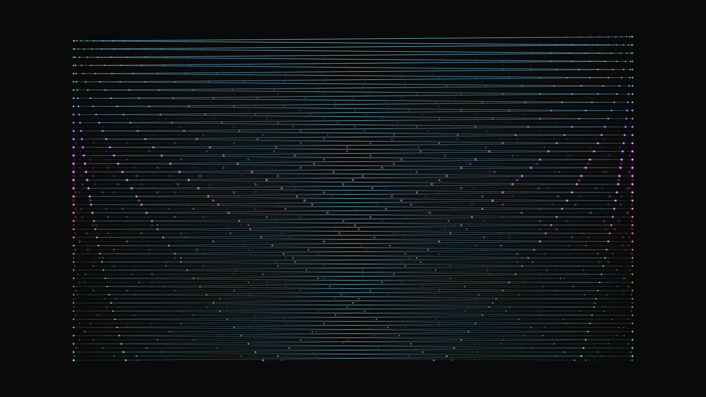

# kinetic_oscillating_pendulum_waves_2d

## Metadata
- **Date**: 2026-06-27
- **Theme**: A 2D simulation of the classic pendulum wave experiment
- **Technique**: Unknown
- **Logic Lab Reference**: 

## Concept
A 2D simulation of the classic pendulum wave experiment. Dozens of glowing pendulums swing left and right with harmonically tuned frequencies, creating mesmerizing interference patterns that shift from waves, to chaos, to perfect realignment over the 15-second loop.

## Technical Details
- **Renderer**: Unknown
- **Simulation**: Unknown
- **Visuals**: Unknown
- **Animation**: 
