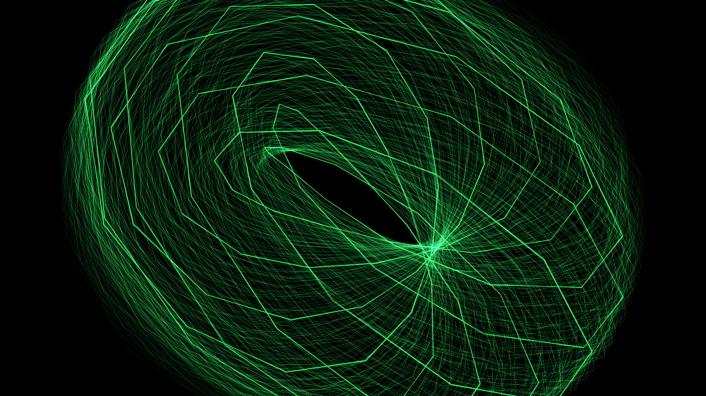

# kinetic_oscilloscope_lissajous_knot_3d

## Metadata
- **Date**: 2026-06-28
- **Theme**: A glowing green electron beam traces an infinitely complex 3D knot on an old analog oscilloscope, le
- **Technique**: 3D Torus knot parametric equations driven by continuous time parameters. The drawing is rendered using pure 2D lines projected mathematically from 3D space. The trail is formed by drawing "ghosts" of the past 15 frames with decreasing alpha values and additive blending.
- **Logic Lab Reference**: 

## Concept
A glowing green electron beam traces an infinitely complex 3D knot on an old analog oscilloscope, leaving a phosphor trail that slowly decays.

## Technical Details
- **Renderer**: Unknown
- **Simulation**: Unknown
- **Visuals**: Unknown
- **Animation**: Contains animation details
