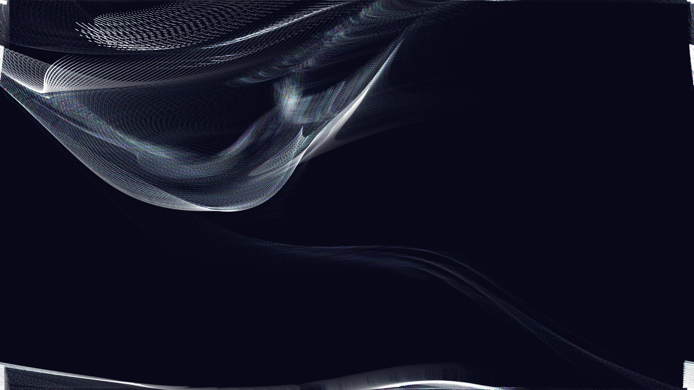

# kinetic_particles_curl_noise_flow_2d

## Metadata
- **Date**: 2026-07-01
- **Theme**: A kinetic animation depicting perfectly smooth, divergence-free fluid motion created by calculating 
- **Technique**: Unknown
- **Logic Lab Reference**: 

## Concept
A kinetic animation depicting perfectly smooth, divergence-free fluid motion created by calculating the analytical curl of a 2D scalar potential field.

## Technical Details
- **Renderer**: Unknown
- **Simulation**: Unknown
- **Visuals**: Unknown
- **Animation**: Contains animation details
