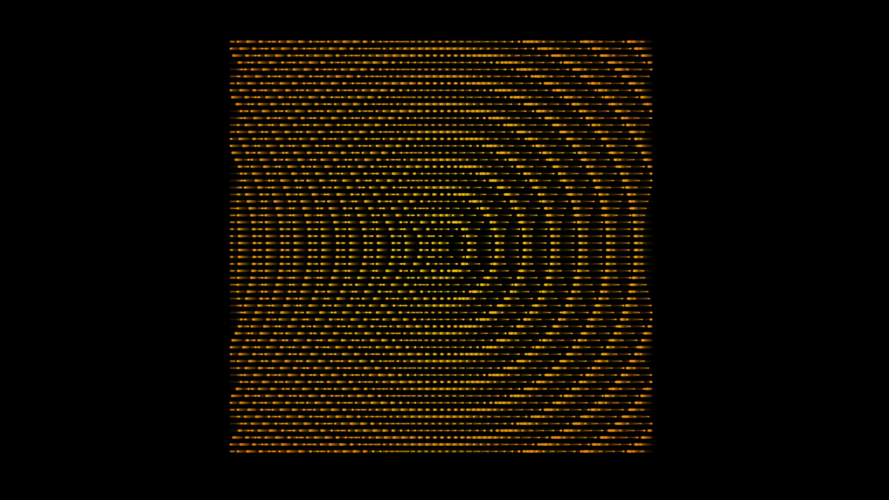

# kinetic_pendulum_wave_harmonics_2d

## Metadata
- **Date**: 2026-06-28
- **Theme**: An animated sequence of kinetic pendulum wave harmonics in 2D
- **Technique**: Unknown
- **Logic Lab Reference**: 

## Concept
An animated sequence of kinetic pendulum wave harmonics in 2D.

- **Theme**: A hypnotic, rhythmic display of pendulum wave harmonics. A grid of swinging orbs perfectly synchronize and desynchronize, forming shifting waves and complex interference patterns before resolving back into unity.
- **Technique**: A 2D array of hundreds of pendulums represented by glowing circles. The frequency of each pendulum is a function of its index or distance from the center, creating the classic pendulum wave effect but extended to a 2D grid. The circles have trailing motion blur (drawn with low alpha over previous frames).
- **Format**: Animation (15s @ 60fps)

## Technical Details
- **Renderer**: Unknown
- **Simulation**: Unknown
- **Visuals**: Unknown
- **Animation**: Contains animation details
